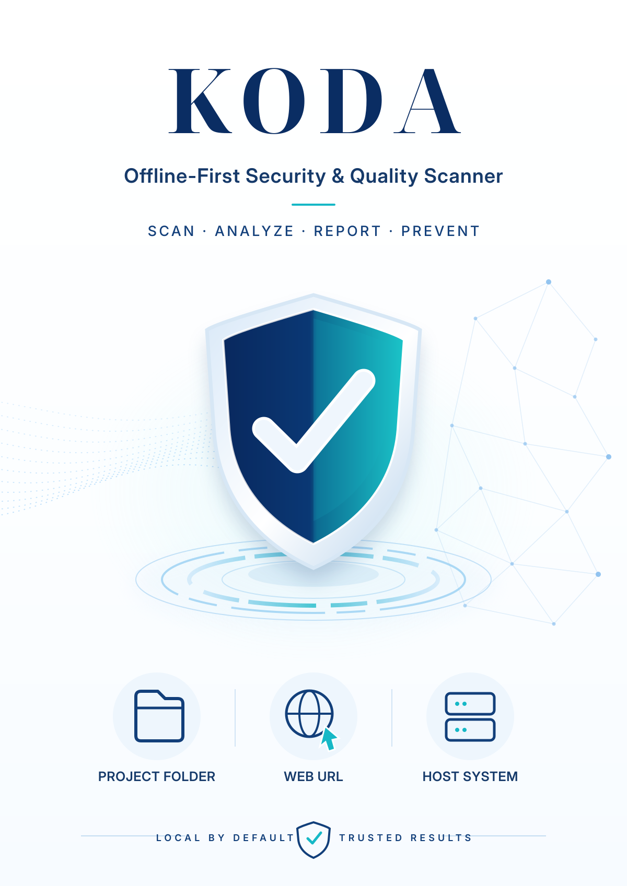
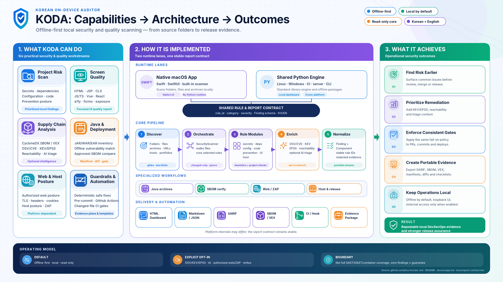

# KODA

<p align="center">
  
</p>

<p align="center">
  <strong>Offline-first local security and quality scanner for source code, configuration, dependencies, host posture, and screen quality.</strong>
</p>

<p align="center">
  <a href="https://apps.apple.com/kr/app/koda/id6770264012?mt=12">Download KODA on the Mac App Store</a> ·
  <a href="docs/README.en.md">🇬🇧 English documentation</a> ·
  <a href="docs/README.md">🇰🇷 한국어 문서</a>
</p>

KODA keeps scans local by default. The native macOS app has its own Swift scanner; Linux, Windows, CI, and server deployments use the shared Python engine in [`platforms/shared/python/`](platforms/shared/python/).

## Choose your path

| I want to… | Start here |
| --- | --- |
| Install the native macOS app | [Mac App Store](https://apps.apple.com/kr/app/koda/id6770264012?mt=12) or [macOS install guide](docs/install/macos.md) |
| Run KODA on Linux | [Linux install and operation guide](docs/install/linux.md) |
| Deploy KODA, KODA SBOM Tracker, and Dependency-Track together in an air-gapped network | [Combined Linux suite guide](platforms/linux/suite/README.ko.md) |
| Diagnose an air-gapped suite installation | [Closed-network troubleshooting guide](platforms/linux/suite/TROUBLESHOOTING.ko.md) |
| Build or install the Windows desktop app | [Windows install guide](docs/install/windows.md) |
| Scan JAR/WAR/EAR files on an offline server | [Offline Java SBOM and vulnerability runbook](docs/security/java-sbom-vulnerability-scan.en.md) |
| Choose an air-gapped delivery method | [Offline delivery overview](docs/install/offline-delivery.en.md) |
| Run scans, configure reports, or set up CI | [CLI and local usage](docs/usage.md) |
| Run the approval-gated 21-control web audit | [Web audit runbook](docs/security/WEB_AUDIT.md) |
| Integrate with security tooling | [Security integration docs](docs/README.en.md#security-integrations) |

## Platform support

| Capability | macOS app | Windows installer | Linux host package | Linux Docker package |
| --- | --- | --- | --- | --- |
| Local source, configuration, dependency, and quality scan | Yes | Yes | Yes | Yes |
| Dashboard | Native app | WebView2 desktop window | Authenticated `/koda/` portal | Authenticated `/koda/` portal behind the suite gateway |
| Offline JAR/WAR/EAR SBOM and vulnerability scan | Yes | Yes | Yes | Yes |
| Baseline SBOM verification | No | Yes | Yes | Yes |
| Host posture scan | Limited; App Sandbox reports system-only checks as Unverified | Yes | Yes | No |
| Live web posture or ZAP baseline | Yes | Yes | Yes | No, by design |
| Profile-driven 21-control web audit | No; use shared engine from source | Full build | Shared engine | No, by design |
| NIS-SBOM 1.0 CSV export | No | Shared dashboard and CLI | Authenticated portal and CLI | Authenticated portal and CLI |

The Python engine can run from source on any OS. The macOS column above refers only to the native app.

## Quick start

Requires Python 3.10 or later — the engine uses only the standard library, so there is no `pip install` step.

```bash
git clone https://github.com/jhny-kor/sec-chk.git
cd sec-chk
export PYTHONPATH="$PWD/platforms/shared/python"
python3 -m security_scanner app
```

This starts the cross-platform local app at `http://127.0.0.1:8765` (loopback
only; nothing leaves your machine). A Linux server uses the authenticated
`/koda/` portal instead: KODA SBOM Tracker owns the account and session, while
KODA applies its own project roles and administrator-only rule settings.

To scan your own project, copy the example config, point `targets[].path` at your project folder, and run a scan:

```bash
cp platforms/shared/python/scanner_config.example.json my-config.json
# edit my-config.json: change "path": "." to your project folder
python3 -m security_scanner scan --config my-config.json
```

The HTML report is written to `reports/security-dashboard.html`.

Use a narrow target before scanning large folders. Normal scans are read-only. `fix --apply`, prevention-template generation, and authorized web or ZAP scans can change files or contact a target; see [CLI and local usage](docs/usage.md) before using them.

## NIS-SBOM export and closed-network suite

The shared Windows/Linux engine exports the 20 basic SBOM fields described by
the 2024 joint [SW Supply Chain Security Guideline 1.0](https://www.krcert.or.kr/kr/bbs/view.do?bbsId=B0000127&menuNo=205021&nttId=71432&pageIndex=1)
as UTF-8 CSV. Choose **NIS-SBOM 1.0 (CSV)** in the Windows shared dashboard or
in a completed Linux portal analysis round, or use either CLI form:

```bash
koda scan --target /path/to/project --format nis-sbom --output reports/koda-nis-sbom-1.0.csv
koda jar-scan --target /deploy/apps --sbom-format nis-1.0 --output-dir reports/java-scan
```

This is format support for evidence exchange, not NIS certification or a
compliance decision. Fields that KODA cannot establish from scanned evidence
remain empty.

For an air-gapped Linux x86_64 server, `package-suite-offline.sh` wraps the
verified KODA and Tracker payloads—including Tracker's Dependency-Track
services—into one archive. The installed `koda-suite` command starts one gateway
with Tracker at `/`, KODA at `/koda/`, and Dependency-Track at
`/dependency-track/`; see the [combined suite guide](platforms/linux/suite/README.ko.md).
The authenticated KODA portal keeps searchable project and analysis-round
history, runs the bundled offline Grype database for exact manifest dependency
versions, and exports the same HTML pair, PDF, Excel, HWPX, JSON, and Markdown
report payload used by the shared Windows/Linux CLI renderer.

## Capabilities and architecture

[](docs/assets/readme/koda-capabilities-architecture-outcomes-en.png)

The diagram summarizes KODA's supported workflows, the native macOS and shared Python runtime lanes, and the evidence they produce. Click it to open the full-resolution version. “No Python runtime” means the native macOS workflow does not require users to install Python separately; platform-specific internals are described in the installation guides.

## What KODA helps you do

| When you need to… | KODA provides | Result |
| --- | --- | --- |
| Find common project risks before review or release | Local source, dependency, configuration, secret, and prevention checks | A prioritized local report and an optional CI gate. |
| Check whether a UI has basic quality issues | `screen_quality` checks for markup accessibility and exposure problems | A focused quality report for HTML/JSP/CLX/JS/Vue/React sources. |
| Prioritize dependency findings | Optional OSV/CVE, CISA KEV, FIRST EPSS, reachability, and AI triage | More context without changing the original finding severity. |
| Audit deployed Java archives offline | JAR/WAR/EAR inventory, CycloneDX SBOM, vulnerability matching, and baseline comparison | Evidence for what is deployed and whether it matches an approved SBOM. |
| Check a workstation or an authorized web target | Optional host posture, web posture, ZAP, and profile-driven 21-control workflows | A bounded security posture report; active checks require explicit authorization and declared pass/rejection oracles. |

Security scans run `secrets`, `dependencies`, `configuration`, `code`, and `prevention` by default. `screen_quality` and `host` are separate categories. A zero-finding result is not a security guarantee; coverage depends on selected checks, reachable targets, and available data.

## Documentation

The [English documentation index](docs/README.en.md) is the complete map. The [Korean documentation index](docs/README.md) is available separately. Common references:

| Topic | Document |
| --- | --- |
| CLI commands, configuration, reports, CI, and auto-fix | [CLI and local usage](docs/usage.md) |
| Closed-network Docker, Linux, Windows, and combined Tracker delivery | [Offline delivery overview](docs/install/offline-delivery.en.md) |
| Closed-network installation errors and recovery | [Air-gapped suite troubleshooting](platforms/linux/suite/TROUBLESHOOTING.ko.md) |
| macOS, Linux, and Windows installation | [Install guides](docs/README.en.md#installation-and-delivery) |
| Java SBOM, pre-commit, Dependency-Track, ZAP, VEX, and supply-chain guidance | [Security integration docs](docs/README.en.md#security-integrations) |
| Approval-gated web controls, profiles, OAST, and package limits | [Web audit runbook](docs/security/WEB_AUDIT.md) |
| Report fields and output contracts | [Report contract](docs/report-contract.md) |
| Dashboard design rationale and limits | [Dashboard research](docs/security-dashboard-research.md) |

## Repository layout

| Path | Purpose |
| --- | --- |
| `platforms/shared/python/` | Shared Python engine for Linux, Windows, CI, and server use. |
| `platforms/macos/` | Native Swift app, packaging, and macOS scripts. |
| `platforms/linux/` | Offline host and Docker distributions. |
| `platforms/windows/` | Windows packaging, scripts, and installer assets. |
| `docs/` | Installation, operating, security-integration, and product documentation. |
| `tests/` | Shared engine, wrapper, and report-contract tests. |

Generated outputs such as `dist/`, `reports/`, and `.build/` are not primary source.

## Scope and safety

KODA is a local scanner and workflow aid. It does not replace full SAST, authenticated DAST, dependency advisory services, container scanning, CVSS scoring, or manual security review. Run live web and ZAP scans only against systems you own or are explicitly authorized to test.

## License

[Apache License 2.0](LICENSE). If you redistribute this project or a derivative work, retain the copyright, license, and attribution notices, include a copy of the license, and clearly mark files that you changed as required by the license. See [NOTICE](NOTICE) for the project attribution.

This license change applies to this version and later versions. Rights already granted for copies distributed under the previous MIT license are not retroactively revoked. See [SECURITY.md](SECURITY.md) for vulnerability reporting and [PRIVACY.md](PRIVACY.md) for the privacy policy.
