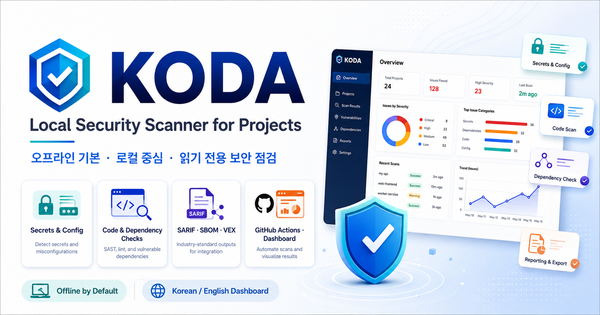
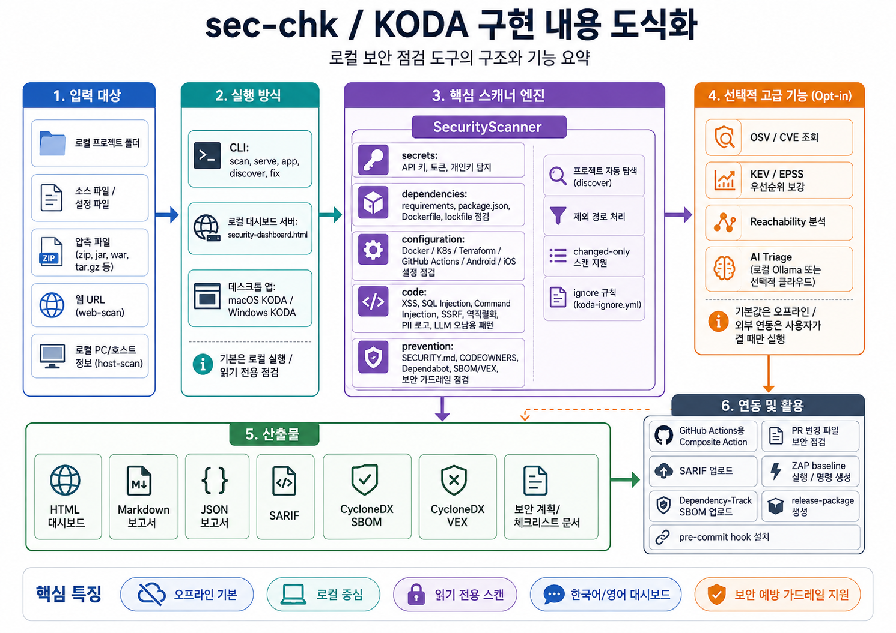

# KODA Platform Index

<p align="center">
  
</p>

<p align="center">
  <strong>Offline-first local security and quality scanner for project source, configuration, dependencies, host posture, and screen quality.</strong>
</p>

<p align="center">
  <a href="https://apps.apple.com/kr/app/koda/id6770264012?mt=12">Download KODA on the Mac App Store</a>
</p>

<p align="center">
  
</p>

KODA is organized as a platform-first local security and quality scanner. The macOS app keeps its native Swift scanner, while Linux, Windows, CI, and server deployments use the shared Python engine under `platforms/shared/python/`.

| Area | Path | Notes |
| --- | --- | --- |
| Shared Python engine | `platforms/shared/python/` | CLI package for Linux, Windows, CI, and server use. |
| macOS native app | `platforms/macos/app/KODA/` | Swift app with native scanner; it does not call the Python engine. |
| macOS packaging/scripts | `platforms/macos/packaging/`, `platforms/macos/scripts/` | App Store assets, entitlements, and local script wrappers. |
| Linux distribution | `platforms/linux/` | Offline install/package layer for closed-network servers. |
| Windows distribution | `platforms/windows/` | Windows scripts, Inno Setup packaging, and assets. |
| Install docs | `docs/install/` | Platform-specific install and usage notes. |

## Repository Layout

`platforms/` contains the actively maintained runtime and packaging code. Other tracked folders keep project governance, docs, tests, and legacy/reference material:

| Path | Role |
| --- | --- |
| `.github/` | GitHub Actions, composite KODA scan action, Dependabot, and CODEOWNERS. |
| `docs/` | Roadmaps, platform install guides, release notes, and security integration docs. |
| `tests/` | Python unit tests for the shared engine, platform wrappers, and report contracts. |
| `archive/` | Legacy material kept for reference; not the active distribution path. |
| `store-assets/` | Store listing screenshots and marketing assets. |
| `icon/` | Source images used to create product icons. |
| root files | Repository-wide policy and metadata such as `README.md`, `SECURITY.md`, `PRIVACY.md`, `LICENSE`, and `koda-ignore.yml`. |
| generated outputs | `dist/`, `reports/`, `.build/`, and release package folders are build/report artifacts, not primary source. |

The old root-level `security_scanner/`, `scripts/`, and `packaging/` source locations were moved into `platforms/`. Any leftover local `scripts/` or `packaging/` directory should be treated as generated or untracked residue unless Git shows tracked files in it.

## Platform-First Refactor Summary

- Moved the shared Python scanner from `security_scanner/` to `platforms/shared/python/security_scanner/`.
- Moved Python package metadata and example scanner configs into `platforms/shared/python/`.
- Moved the macOS Swift app to `platforms/macos/app/KODA/`.
- Moved macOS packaging assets and scripts to `platforms/macos/packaging/` and `platforms/macos/scripts/`.
- Moved Windows packaging, assets, and scripts to `platforms/windows/`.
- Added the Linux offline/server distribution layer under `platforms/linux/`.
- Updated CI, tests, installer scripts, and docs to use `platforms/shared/python` for Linux, Windows, CI, and server flows.
- Kept macOS native scanning separate: the Swift app does not call the Python engine and only shares the rule/report contract.

Detailed install guides:

- Closed-network delivery overview: `docs/install/offline-delivery.md`
- macOS: `docs/install/macos.md`
- Linux: `docs/install/linux.md`
- Windows: `docs/install/windows.md`
- Windows vulnerability-data refresh: `docs/install/vuln-data-refresh.md`
- Report contract: `docs/report-contract.md`

Read-only security scanner for local project folders. It scans configured paths, can auto-discover project roots under a parent folder, and runs selected vulnerability categories without installing dependencies. The default scan is offline; OSV/CVE and KEV/EPSS dependency intelligence is opt-in because it queries external security feeds.

Korean guide: [한국어 안내](#한국어-안내)

Install quickly:

| OS | Installer | Result |
| --- | --- | --- |
| macOS (App Store) | Install [KODA from the Mac App Store](https://apps.apple.com/kr/app/koda/id6770264012?mt=12) | Native KODA app with the built-in Swift scanner; no Python required |
| macOS | Double-click `platforms/macos/scripts/install-macos.command` | Installs to `~/Library/Application Support/SecChk` and creates `~/Applications/SecChk.command` |
| Windows | Run `dist/Windows/KODASetup.exe` after the Windows build | Installs to `%LOCALAPPDATA%\KODA` and creates a `KODA` Start Menu shortcut. Launches as a single native window (no console, no separate browser tab), matching the macOS app. NVD/CISA KEV data ships separately as `koda-vuln-data-<date>.zip`; see `docs/install/vuln-data-refresh.md`. |
| Linux (closed network) | Extract `dist/linux/koda-docker-offline-x86_64-<version>.tar.gz` (Docker) or `koda-linux-x86_64-<version>.tar.gz` (host install), then run the bundled `install.sh` | One-file offline deliverable with Syft, Grype, pre-imported Grype DB, NVD, and CISA KEV; see `docs/install/offline-delivery.md`. |

## Feature Availability by Platform

Support by installed deliverable. Running the Python engine from source (`PYTHONPATH=platforms/shared/python`) provides every CLI feature on any OS, including macOS; the macOS app column describes the native Swift app only.

| Feature | macOS app | Windows installer | Linux tarball | Linux Docker deliverable |
| --- | --- | --- | --- | --- |
| Source security scan (secrets, dependencies, configuration, code, prevention) | ✅ built-in Swift scanner | ✅ | ✅ | ✅ read-only target mount |
| Screen quality scan (`screen_quality`) | ✅ | ✅ | ✅ | ✅ |
| Dashboard UI | ✅ native app window | ✅ WebView2 single window | ✅ `koda serve` | ✅ `koda-docker dashboard`, loopback-bound |
| JAR/WAR/EAR SBOM + vulnerability scan (`jar-scan`) | ✅ bundled Syft/Grype/DB/NVD/KEV | ✅ tools bundled; needs `koda-vuln-data-<date>.zip` for NVD/KEV | ✅ all data bundled | ✅ all data in image |
| Baseline SBOM verification (`sbom-verify`, `--verify-sbom`) | ❌ | ✅ | ✅ | ✅ incl. `audit` shortcut |
| Host posture scan (`host-scan`) | ❌ | ✅ | ✅ | ❌ out of scope (container ≠ host) |
| Live web scan (`web-scan`) | ❌ | ✅ | ✅ | ❌ runs with `--network none` |
| OSV/CVE + KEV/EPSS online lookup | ✅ in-app | ✅ internet required | ✅ internet required | ❌ offline by design |
| ZAP baseline (`zap-run`) | ✅ via Docker | ✅ via Docker | ✅ via Docker | ❌ no Docker socket in container |
| Prevention guardrail generation (`init-security`, prevention kit) | ✅ | ✅ | ✅ | ❌ target mounts are read-only |
| Auto-fix (`fix --apply`) | ❌ | ✅ | ✅ | ❌ target mounts are read-only |
| Dashboard PDF export (bundled Chromium) | n/a (native reports) | ✅ | ✅ | ✅ |
| Vulnerability data refresh | app update | replace `koda-vuln-data-<date>.zip` | replace tarball | replace image |

## What It Checks

- `secrets`: likely API keys, private keys, access tokens, and hard-coded secret assignments.
- `dependencies`: risky dependency manifests, missing lockfiles, unpinned Python requirements, remote shell install scripts, and unsafe image tags.
- `configuration`: committed environment files, private-key-like files, debug flags, risky Docker/Compose settings, Kubernetes workload risks, Terraform exposure/encryption/output patterns, Android/iOS security settings, and GitHub Actions workflow hazards.
- `code`: heuristic code patterns for XSS, SQL injection, command injection, path traversal, SSRF, unsafe deserialization, disabled CSRF/auth checks, risky uploads, cookie/session weakness, JWT validation mistakes, API authorization/rate-limit/mass-assignment risks, outbound API calls without timeouts, PII logging, weak hashes, XML parser risk, risky web-server settings, C/C++ buffer APIs, and AI/LLM prompt/tool misuse patterns.
- `prevention`: preventive guardrails such as `SECURITY.md`, KODA pre-commit gates, Dependabot/Renovate, CI security scanning, SAST readiness, OpenSSF Scorecard posture, GitHub Actions token/action hygiene, CODEOWNERS, repository security settings checklists, `.env` ignore/example hygiene, `.dockerignore`, SBOM/VEX readiness, Dependency-Track handoff, ZAP DAST planning, threat modeling, secret rotation, API security plans, OWASP SCVS component verification plans, privacy data maps, security roadmaps, evidence registers, exception owner/reason/expiry governance, security headers baselines, container hardening baselines, Cloud/IaC security plans, AI/LLM security planning, mobile security planning, NIST CSF 2.0 profiles, NIST SSDF workflow evidence, CISA Secure by Design planning, CISA secure software development attestation, SLSA/Sigstore release provenance, and committed binary artifacts.
- `screen_quality`: static screen-source quality checks for HTML/JSP/CLX/JS/Vue/React markup, including language and viewport metadata, image alt text, input labels, explicit button types, placeholder links, sensitive text exposure, and leaked system paths.

Security scans run `secrets`, `dependencies`, `configuration`, `code`, and `prevention` by default. Run `screen_quality` from the separate screen quality button or by selecting that category explicitly.

## Web Scan Coverage

KODA's lightweight web scan follows discovered same-origin child pages and records each requested URL separately from its final URL. A login redirect, blocked Origin, failed request, or disabled active check is coverage information, not a successful protected-page scan. A result of zero findings is not a safety guarantee; coverage depends on authentication, enabled checks, and reachable pages and APIs.

| Feature | Lightweight web scan | ZAP Baseline | ZAP Active |
| --- | ---: | ---: | ---: |
| Child-page crawl | supported | supported | supported |
| Security headers | supported | supported | supported |
| TLS and cookies | supported | partial | partial |
| Reflected input | limited | manual analysis | supported |
| SQL injection | error-based indication only | limited | supported |
| Authenticated checks | limited | context required | context required |
| Non-GET API | inventory only | API mode | API mode |
| Business-logic vulnerabilities | not supported | not supported | manual review required |

The dashboard's lightweight web scan is read-only by default. OWASP ZAP is a separate, authorized DAST workflow; it does not run merely because a lightweight scan completes.

## Quick Start

Run it like a local app:

```bash
export PYTHONPATH="$PWD/platforms/shared/python"
python3 -m security_scanner app
```

This opens `security-dashboard.html` in the default browser and keeps a local server running until you press `Ctrl+C`. On macOS, you can double-click `platforms/macos/scripts/sec-chk.command` from Finder. On Windows, double-click `platforms/windows/scripts/sec-chk.bat`.

## Installation

macOS users can install SecChk without administrator privileges:

1. Install Python 3.10 or newer.
2. Download or clone this repository.
3. Double-click `platforms/macos/scripts/install-macos.command`.

The macOS installer copies the app to `~/Library/Application Support/SecChk`, creates a private Python virtual environment, and creates `~/Applications/SecChk.command`. To remove it, run `~/Library/Application Support/SecChk/Uninstall-SecChk.command` or double-click `platforms/macos/scripts/uninstall-macos.command` from the downloaded repository.

The native macOS app `KODA` is [available on the Mac App Store](https://apps.apple.com/kr/app/koda/id6770264012?mt=12). Its packaging lives in `platforms/macos/packaging`, with the Xcode project at `platforms/macos/app/KODA/KODA.xcodeproj`. The app supports folder selection, multiple file selection, common archive inputs, and in-app prevention guardrail creation with a built-in Swift scanner, so `.app` scanning and baseline template setup do not require Python. See `docs/store-release.md` for the store checklist.

The native KODA app also includes the prevention workflow that previously required terminal commands: an auto-fix wizard for missing guardrail files, in-app pre-commit gate installation, threat model wizard, compliance dashboard, GitHub repository security checklist export, SLSA/Sigstore release signing plan export, NIST SSDF workflow plan export, NIST CSF 2.0 profile export, CISA Secure by Design plan export, CISA secure software development attestation checklist export, API security plan export, OWASP SCVS plan export, privacy data map export, security roadmap export, evidence register export, security headers baseline export, container hardening baseline export, Cloud/IaC security plan export, AI/LLM security plan export, mobile security plan export, secret rotation runbook export, in-app CycloneDX SBOM export, in-app OSV/CVE lookup enriched with CISA KEV and FIRST EPSS where CVEs are available, CycloneDX VEX draft export, ZAP DAST plan generation and Docker-based ZAP baseline execution for authorized URLs, manual evidence checklists for standards that require evidence review, release security packages, `koda-ignore.yml` exception templates with owner/reason/expiry checks, scan change reports, local score history with latest-vs-previous comparison, remediation guide screens, and saved project profiles for frequently scanned target sets. SBOM and OSV inputs include `requirements.txt`, `requirements.in`, `pyproject.toml`, `poetry.lock`, `Pipfile.lock`, `package.json`, `package-lock.json`, `npm-shrinkwrap.json`, `yarn.lock`, and `pnpm-lock.yaml`.

Windows users can install KODA without administrator privileges after the Windows installer is built on a Windows PC. The macOS App Store SwiftUI app cannot be compiled into a Windows `.exe` on macOS; use the Windows build script for the Python dashboard runtime:

This change does not create, validate, replace, or package Windows EXE or installer artifacts. Run the Windows packaging workflow separately on a Windows build host.

The Windows dashboard uses the same shared HTML and export API as Linux. The
desktop wrapper enables WebView downloads for SBOM and report files; validate the
final `KODASetup.exe` on a Windows build host before distributing it. Linux
installation and server application steps, including the required Chromium PDF
renderer and health/PDF smoke tests, are documented in [`docs/install/linux.md`](docs/install/linux.md).

1. Install Python 3.10 or newer from [python.org](https://www.python.org/downloads/windows/).
2. Install Inno Setup 6.
3. Download or clone this repository on the Windows build PC.
4. Run `powershell -NoProfile -ExecutionPolicy Bypass -File .\platforms\windows\scripts\build-koda-windows-installer.ps1`.

The build creates `dist\KODA\KODA.exe` and `dist\Windows\KODASetup.exe`. Target users only need `KODASetup.exe`; it installs to `%LOCALAPPDATA%\KODA` and adds Start Menu shortcuts named `KODA` and `KODA (Browser Mode)`. The installer bundles Syft, Grype, and the Grype DB for offline `jar-scan`; the daily-changing NVD and CISA KEV feeds ship separately as `koda-vuln-data-<date>.zip` extracted into the install directory (see [`docs/install/vuln-data-refresh.md`](docs/install/vuln-data-refresh.md)). Double-clicking `KODA` opens one native window powered by Edge WebView2 — no console window and no separate browser tab — so it behaves like the macOS KODA app. If the Edge WebView2 runtime is missing, KODA falls back to opening the dashboard in the default browser. On managed PCs where WebView2 is blocked or broken, use `KODA (Browser Mode)` to skip WebView2 and open directly in the default browser.

The active Windows installer files are `platforms/windows/scripts/build-koda-windows-installer.ps1`,
`platforms/windows/scripts/build-koda-windows-installer.bat`, and `platforms/windows/packaging/KODA.iss`.
Legacy SecChk source-tree installer scripts were moved to
`archive/windows/legacy-secchk/` so the active Windows install path stays focused
on the KODA builder and `KODASetup.exe`.

For Microsoft Store distribution, the current Inno Setup installer is not the final upload format. The Store lane should package the Windows app as MSIX and submit a `.msixupload` package through Partner Center. See `platforms/windows/README.md` and `docs/store-release.md`.

Server-only mode is still available:

For a closed-network Linux x86_64 server, use the offline Java archive scanner. It reads JAR/WAR/EAR files, including nested libraries, and writes CycloneDX, Grype, NVD, CISA KEV, HTML, Markdown, and metadata outputs without online lookups. Three deliverables cover the closed-network paths (see [`docs/install/offline-delivery.md`](docs/install/offline-delivery.md) for the full comparison):

- **Docker deliverable** (`platforms/linux/package-docker-offline.sh`) — one tar.gz containing a `linux/amd64` image with Syft, Grype, a pre-imported Grype DB, NVD, and CISA KEV. The bundled `koda-docker` wrapper runs every scan with `--network none`, a read-only root filesystem, a non-root user, and read-only target mounts, and adds `audit` (jar-scan + baseline SBOM + KEV gate in one command) and `dashboard start|status|logs|stop`.
- **Linux host tarball** (`platforms/linux/package-offline.sh`) — the same engine and data installed directly under a user-owned prefix for servers without Docker.
- **Windows installer + data package** — `KODASetup.exe` bundles the tools; NVD/CISA KEV arrive separately as `koda-vuln-data-<date>.zip` (built with `package-offline.sh --vuln-data-only`) so data refreshes never require an installer rebuild.

~~~bash
# Docker deliverable
./koda-docker jar-scan --target /jeus/domains/domain1/applications \
  --output-dir reports/java-scan --fail-on high --fail-on-kev

# Host install (paths are detected automatically after install.sh)
/home/user0/koda/koda jar-scan --target /jeus/domains/domain1/applications \
  --output-dir reports/java-scan --fail-on high --fail-on-kev
~~~

`sbom-verify` compares an approved CycloneDX SBOM against the deployed archives (version, Maven PURL, and SHA-256), and `jar-scan --verify-sbom` chains scan plus verification. With `--fail-on-kev`, missing CISA KEV data exits `2` instead of silently passing the gate. See [the offline Java SBOM runbook](docs/security/java-sbom-vulnerability-scan.md) for the preparation and update procedure.

```bash
export PYTHONPATH="$PWD/platforms/shared/python"
python3 -m security_scanner serve
```

Open `http://127.0.0.1:8765/security-dashboard.html`, choose a folder to scan, select a security standard/category such as OWASP Top 10:2025, CWE/SANS Top 25:2025, CWE, ISMS-P 2.8, Korea SW Development Security 49, KISA Secure Coding Guide, NCSC Web 8, Electronic Financial Supervision 8, OWASP ASVS, OWASP WSTG, OWASP MASVS, OWASP LLM Top 10:2025, OWASP SCVS, NIST SSDF, NIST CSF 2.0, OWASP SAMM, OpenSSF Scorecard, CISA KEV / FIRST EPSS, CISA Secure by Design, CISA secure software development attestation, SLSA / Sigstore, or OWASP dependency/SBOM baselines, and run the check from the dashboard. Turn on `OSV/CVE + KEV/EPSS lookup` when you want exact-version dependency advisories from OSV.dev plus KEV/EPSS prioritization.

To generate a static dashboard file instead:

```bash
PYTHONPATH=platforms/shared/python python3 -m security_scanner scan --config platforms/shared/python/scanner_config.example.json
```

Use a narrower target before scanning a large folder. Normal scans are read-only, but the optional prevention guardrail action intentionally writes template files to folders you explicitly choose. Broad scans can produce noisy reports.

For a portfolio-style scan of a folder that contains multiple projects:

```bash
python3 -m security_scanner discover --target /path/to/projects
SEC_CHK_TARGET=/path/to/projects PYTHONPATH=platforms/shared/python python3 -m security_scanner scan --config platforms/shared/python/scanner_config.documents.example.json
```

## Configuration

Copy `scanner_config.example.json` and edit the `targets` list:

```json
{
  "targets": [
    {
      "name": "security-workspace",
      "path": ".",
      "discover_projects": false,
      "categories": ["secrets", "dependencies", "configuration", "code", "prevention"],
      "exclude_globs": ["**/.git/**", "**/node_modules/**"],
      "max_file_size_bytes": 524288
    }
  ],
  "enable_osv": false,
  "enable_vuln_intel": false,
  "report": {
    "format": "html",
    "output": "reports/security-dashboard.html",
    "min_severity": "low",
    "language": "ko"
  }
}
```

To suppress a known false positive without changing the scanner rules, create `koda-ignore.yml` or `.koda-ignore.yml` at the scanned folder root. Matching entries are skipped until the optional expiry date:

```yaml
ignore:
  - rule: secret.openai-key
    path: .env
    reason: local development placeholder
    until: 2099-12-31
```

## CLI

```bash
python3 -m security_scanner app
python3 -m security_scanner list-categories
python3 -m security_scanner serve
python3 -m security_scanner discover --target /path/to/projects
python3 -m security_scanner scan --target /path/to/project --category secrets --format json
python3 -m security_scanner scan --config scanner_config.example.json --fail-on high
python3 -m security_scanner scan --target . --format sarif --output reports/results.sarif
python3 -m security_scanner scan --target . --format cyclonedx --output reports/sbom.cdx.json
python3 -m security_scanner scan --target . --enable-osv --format html
python3 -m security_scanner scan --target . --enable-vuln-intel --format html
python3 -m security_scanner scan --target . --enable-osv --reachability --format json
python3 -m security_scanner scan --target . --ai-triage --llm ollama/qwen2.5-coder:7b --format json
python3 -m security_scanner scan --target . --changed-only --base origin/main --format sarif --fail-on high
python3 -m security_scanner fix --target .            # dry-run diff; add --apply to write changes
python3 -m security_scanner scan --target . --enable-vuln-intel --format cyclonedx-vex --output reports/vex.cdx.json
python3 -m security_scanner init-security --target . --project-name my-project
python3 -m security_scanner install-hook --target . --fail-on high
python3 -m security_scanner repo-security-checklist --target . --output docs/security/GITHUB_REPOSITORY_SECURITY.md
python3 -m security_scanner ssdf-plan --target . --output docs/security/NIST_SSDF_WORKFLOW.md
python3 -m security_scanner secure-by-design-plan --target . --output docs/security/SECURE_BY_DESIGN.md
python3 -m security_scanner sigstore-plan --target . --artifact dist/app.tar.gz --output docs/security/SLSA_SIGSTORE_PLAN.md
python3 -m security_scanner web-scan --url https://example.com --format markdown
python3 -m security_scanner zap-command --url https://example.com --output-dir reports/zap
python3 -m security_scanner zap-run --url https://example.com --output-dir reports/zap
python3 -m security_scanner evidence-checklist --target . --output docs/security/evidence-checklist.md --language ko
python3 -m security_scanner release-package --target . --output-dir release-security --project-name my-project
python3 -m security_scanner diff-reports --baseline reports/old.json --current reports/new.json --output reports/diff.md
python3 -m security_scanner manifest create --target /deploy/app --output reports/approved-manifest.json
python3 -m security_scanner manifest compare --baseline reports/approved-manifest.json --target /app/current --output reports/manifest-compare.json
python3 -m security_scanner deploy-check --target /deploy/app --output-dir reports/koda-deploy --fail-on high
python3 -m security_scanner jar-scan --target /deploy/apps --output-dir reports/java-scan --fail-on high --fail-on-kev
python3 -m security_scanner sbom-verify --target /deploy/apps --sbom reports/approved-sbom.cdx.json --output-dir reports/sbom-verification --strict-hash --fail-on-mismatch
python3 -m security_scanner dependency-track-command --server-url https://dependency-track.example.com --project-name my-project --project-version main --sbom reports/sbom.cdx.json
python3 -m security_scanner upload-sbom --server-url https://dependency-track.example.com --api-key-env DEPENDENCY_TRACK_API_KEY --project-name my-project --project-version main --sbom reports/sbom.cdx.json
SEC_CHK_TARGET=/path/to/projects python3 -m security_scanner scan --config scanner_config.documents.example.json --language ko
```

`--fail-on` returns a non-zero exit code when findings at or above that severity are present, which is useful for CI or scheduled jobs.

`--enable-osv` sends exact package names and pinned versions from supported manifests to OSV.dev. `--enable-vuln-intel` implies OSV and enriches CVEs with CISA Known Exploited Vulnerabilities and FIRST EPSS priority data. Both are disabled by default so normal local scans remain offline.

`--reachability` adds an offline, dependency-free pass that labels each OSV dependency finding as `reachable`, `unreachable`, or `unknown` by analyzing the imports in the scanned Python (`ast`) and JavaScript/TypeScript source. A vulnerable package that is never imported is marked `unreachable` so it can be deprioritized; the finding is never removed. With `--fail-on`, add `--reachable-only` to ignore `unreachable` findings when deciding the exit code. The `reachable` label is included in the JSON report.

`--ai-triage` is an opt-in pass that asks a large language model to label each finding as `likely_true`, `likely_false`, or `uncertain`, with a confidence and a one-line reason, to help filter false positives. It is disabled by default. The model is selected with `--llm` or the `KODA_LLM` environment variable using a `<backend>/<model>` spec: `ollama/qwen2.5-coder:7b` (local, no data leaves the machine — the default and recommended path), `anthropic/<model>`, or `openai/<model>` (cloud backends are optional extras and require an API key in `KODA_LLM_API_KEY`). AI triage never changes a finding's severity, so the `--fail-on` gate stays deterministic; the labels (`triage_verdict`, `triage_confidence`, `triage_note`) are added to the JSON report. Raw secret values are never sent to a backend. If no model is configured or the backend is unreachable, the scan continues unlabelled with a warning. See [PRIVACY.md](PRIVACY.md) for what each backend transmits.

`--changed-only --base <ref>` scans only the files changed versus a base git ref, which is the fast path for per-pull-request checks. KODA runs `git diff --name-only <ref>...HEAD` and restricts file-based checks to that set; project-level prevention checks are skipped while diff-scoping. If git is unavailable, the base ref is missing, or the checkout is shallow, KODA prints a warning and falls back to a full scan rather than hiding findings, so the gate is never silently weakened.

### Continuous integration (GitHub Actions)

This repository ships a composite action at `.github/actions/koda/`. From another repository, scan changed files on every pull request and upload results to GitHub code scanning:

```yaml
jobs:
  koda-security:
    runs-on: ubuntu-latest
    permissions:
      contents: read
      security-events: write   # required to upload SARIF
    steps:
      - uses: actions/checkout@v4
        with:
          fetch-depth: 0        # full history so --changed-only can diff the base branch
      - uses: <owner>/<koda-repo>/.github/actions/koda@main
        with:
          fail-on: high
          changed-only: "true"  # base ref defaults to origin/<PR base branch>
```

The action installs KODA, runs the scan with `--format sarif` and `--fail-on`, and uploads the SARIF file. On pull requests it scopes to changed files automatically. Set `fail-on: none` to report without failing the build.

### Auto-fix

`python3 -m security_scanner fix --target .` applies safe, deterministic fixes for the subset of findings that have an unambiguous correction (currently `code.weak-hash` rewriting `.md5(`/`.sha1(` to `.sha256(`, and `code.unsafe-deserialization` rewriting `yaml.load(` to `yaml.safe_load(`). It is **dry-run by default**: it prints a unified diff and writes nothing. Add `--apply` to write the changes; each modified file is backed up as `*.bak` first (use `--no-backup` to skip), and for Python files the result is re-parsed so a fix that would break syntax is skipped rather than written. Scope it with `--rule <id>` to fix one rule at a time. Fixes are line-scoped and conservative — anything uncertain is left for manual review. Supported dependency inventory inputs include Python requirements, `pyproject.toml`, `poetry.lock`, `Pipfile.lock`, npm package locks, `yarn.lock`, and `pnpm-lock.yaml`; range-only entries such as `^1.2.3` or `>=1.2` are kept in the SBOM but skipped for OSV until a lockfile resolves the exact version.

`init-security` creates preventive templates without overwriting existing files by default: `SECURITY.md`, Dependabot, a KODA GitHub Actions security workflow with SBOM and OpenSSF Scorecard jobs, CODEOWNERS, a release provenance workflow, `.dockerignore`, `.env.example`, pre-commit guidance, GitHub repository security checklist, ZAP/Dependency-Track notes, VEX tracking notes, SLSA/Sigstore release guardrails, NIST SSDF workflow plan, CISA Secure by Design plan, threat model, secret rotation runbook, API security plan, OWASP SCVS plan, privacy data map, security roadmap, evidence register, security headers baseline, container hardening baseline, Cloud/IaC security plan, AI/LLM security plan, mobile security plan, NIST CSF 2.0 profile, and CISA secure software development attestation checklist. In the native KODA macOS app, the same baseline files can be created from `Prevention Kit > Apply Guardrails to Folders`.

`install-hook` installs a local KODA pre-commit gate in a Git repository. `repo-security-checklist`, `ssdf-plan`, `secure-by-design-plan`, and `sigstore-plan` create focused Markdown plans for repository-hosted settings, NIST SSDF workflow evidence, CISA Secure by Design prevention work, and SLSA/Sigstore release signing.

`web-scan` runs a live check against an authorized URL using the Python standard library (no Docker; Playwright is an optional extra for JS rendering). The default single-page scan sends one GET plus one TLS handshake and reports missing/weak security headers (HSTS incl. quality, CSP incl. quality, X-Content-Type-Options, clickjacking protection, Referrer-Policy, Permissions-Policy), TLS certificate expiry and weak negotiated protocols, cookie flags (Secure/HttpOnly/SameSite), HTTP-to-HTTPS enforcement, information disclosure (Server/X-Powered-By), wildcard CORS, mixed content, missing SRI, and CSRF-less forms. Optional flags widen the footprint: `--crawl` fetches many same-host pages; `--render`/`--interact`/`--capture-network`/`--discover-assets` discover SPA routes and API endpoints (with form login or injected cookies); `--scan-js-secrets` scans JS bundles for leaked keys; `--ingest-sitemap` reads robots.txt/sitemap.xml; `--probe-paths` actively requests well-known sensitive paths and a GraphQL introspection query. It never sends attack payloads or fuzzes parameters, but crawling/probing issue many requests — run it only against systems you own or are explicitly authorized to test. It does not replace professional SAST, authenticated DAST, or manual review; use `zap-run` for deeper dynamic testing.

`zap-command` prints an OWASP ZAP baseline Docker command for an authorized URL. `zap-run` runs that baseline through Docker, writes the ZAP HTML/Markdown/JSON outputs, and emits a `koda-zap-findings.json` summary. Only run it against systems you own or are explicitly authorized to test.

`evidence-checklist` creates a manual evidence checklist for standards that cannot be fully proven from local files, such as ASVS, WSTG, ISMS-P, NIST SSDF, and OWASP SAMM. `release-package` creates a release security folder with SBOM, VEX, scan findings, manual evidence checklist, checksums, and a manifest. `diff-reports` compares two JSON scan reports and shows added/resolved findings.

`manifest create` records the deployed file shape with relative path, SHA-256, size, and modified time. `manifest compare` compares that approved manifest against a target directory and reports added, removed, changed, and unchanged files. `deploy-check` runs the normal local scan as a deployment gate and writes both `koda-deploy-scan.json` and `koda-deploy-manifest.json` under the selected output directory.

`upload-sbom` sends a CycloneDX SBOM to a Dependency-Track backend using `/api/v1/bom`; keep the API key in `DEPENDENCY_TRACK_API_KEY` or another environment variable.

Report formats:

- `html`: static dashboard with severity metrics, project comparison, filters, KO/EN toggle, Help view, coverage matrix, rule details, SBOM download, optional OSV/CVE + KEV/EPSS lookup, official standard links, and a finding table.
- `markdown`: readable text report.
- `json`: scanner-native structured output.
- `sarif`: SARIF 2.1.0 style output for downstream static-analysis consumers.
- `cyclonedx`: CycloneDX JSON SBOM generated from supported dependency manifests.
- `cyclonedx-vex`: CycloneDX VEX JSON draft generated from OSV findings, with each vulnerability left in `in_triage` until a human confirms exploitability.

## Dashboard Design

The HTML dashboard follows common vulnerability-management patterns seen in GitLab Security Dashboard, DefectDojo, OWASP Dependency-Track, SARIF consumers, and CVSS-based triage workflows. See `docs/security-dashboard-research.md` for source notes and implementation limits.

## Notes

This tool is a local static checker with optional external vulnerability intelligence and authorized ZAP baseline execution. It is not a replacement for full SAST, authenticated DAST, dependency advisory databases, container scanners, SBOM analysis platforms, CVSS scoring, or manual security review. It is intended to inventory obvious local risks consistently across project folders.

Security-standard selections are mapping profiles over the local rules. The dashboard Help button explains each standard, mapped check criteria, coverage limits, official links, and whether the profile is classified as automatic checks, external integration required, or evidence review required. Finding remediation cards also show related standards for each local rule. Profiles include OWASP Top 10, CWE/SANS Top 25, CWE, KISA secure-coding and software-development-security guides, NCSC Web 8, Electronic Financial Supervision 8, ISMS-P 2.8, OWASP ASVS, OWASP WSTG, OWASP MASVS, OWASP LLM Top 10:2025, OWASP SCVS, NIST SSDF, NIST CSF 2.0, OWASP SAMM, CISA Secure by Design, CISA secure software development attestation, OpenSSF Scorecard, CISA KEV / FIRST EPSS, SLSA / Sigstore, and OWASP dependency/SBOM baselines. Runtime testing, repository-host metadata, release artifacts, and vulnerability intelligence are labeled as external integration required; organizational policy and operating records are labeled as evidence review required.

## 한국어 안내

로컬 프로젝트 폴더를 기본적으로 읽기 전용으로 점검하는 보안 스캐너입니다. 추가 의존성 설치 없이 설정한 경로를 스캔하고, 하위 프로젝트 자동 탐색과 한국어/영어 토글 대시보드를 제공합니다. 선택 기능인 보안 예방 가드레일 적용은 사용자가 명시적으로 선택한 폴더에 템플릿 파일을 생성합니다. 기본 스캔은 오프라인이며, OSV/CVE와 KEV/EPSS 의존성 인텔리전스 조회는 외부 보안 피드를 호출하므로 사용자가 켰을 때만 실행됩니다.

### 레포 폴더 역할

`platforms/`는 현재 유지보수하는 실행/배포 코드입니다. 그 밖의 추적 폴더는 다음 역할입니다.

| 경로 | 역할 |
| --- | --- |
| `.github/` | GitHub Actions, KODA composite action, Dependabot, CODEOWNERS |
| `docs/` | 로드맵, 플랫폼별 설치 문서, 출시/보안 연동 문서 |
| `tests/` | 공통 Python 엔진, 플랫폼 wrapper, 리포트 계약 테스트 |
| `archive/` | 현재 배포 경로가 아닌 레거시 참고 자료 |
| `store-assets/` | 스토어 등록용 스크린샷과 마케팅 이미지 |
| `icon/` | 제품 아이콘 생성에 쓰는 원본 이미지 |
| 루트 파일 | `README.md`, `SECURITY.md`, `PRIVACY.md`, `LICENSE`, `koda-ignore.yml` 같은 레포 공통 정책/메타데이터 |
| 생성 산출물 | `dist/`, `reports/`, `.build/`, 릴리스 패키지 폴더는 소스가 아니라 빌드/리포트 결과물 |

기존 루트의 `security_scanner/`, `scripts/`, `packaging/` 소스 위치는 `platforms/` 아래로 이동했습니다. 로컬에 같은 이름의 빈 폴더가 남아 있더라도 Git 추적 파일이 없으면 현재 소스 구조가 아닙니다.

### 플랫폼 우선 리팩토링 요약

- 공통 Python 스캐너를 `platforms/shared/python/security_scanner/`로 이동했습니다.
- Python 패키지 설정과 예제 설정 파일을 `platforms/shared/python/`로 이동했습니다.
- macOS Swift 앱을 `platforms/macos/app/KODA/`로 이동했습니다.
- macOS 패키징 자산과 스크립트를 `platforms/macos/packaging/`, `platforms/macos/scripts/`로 이동했습니다.
- Windows 패키징, 자산, 스크립트를 `platforms/windows/`로 이동했습니다.
- Linux 폐쇄망/서버 배포 레이어를 `platforms/linux/`에 추가했습니다.
- CI, 테스트, 설치 스크립트, 문서는 Linux/Windows/CI/서버 경로에서 `platforms/shared/python`을 사용하도록 수정했습니다.
- macOS 네이티브 앱은 Python 엔진을 호출하지 않고, rule/report 계약만 맞추는 방향으로 분리했습니다.

### 설치 방법 요약

| OS | 설치 파일 | 설치 결과 |
| --- | --- | --- |
| macOS (App Store) | [Mac App Store에서 KODA 설치](https://apps.apple.com/kr/app/koda/id6770264012?mt=12) | 내장 Swift 스캐너를 갖춘 네이티브 KODA 앱, Python 불필요 |
| macOS | `platforms/macos/scripts/install-macos.command` 더블클릭 | `~/Library/Application Support/SecChk`에 설치하고 `~/Applications/SecChk.command` 생성 |
| Windows | Windows 빌드 후 `dist/Windows/KODASetup.exe` 실행 | `%LOCALAPPDATA%\KODA`에 설치하고 시작 메뉴 `KODA` 바로가기 생성. macOS 앱과 동일하게 단일 네이티브 창으로 실행되며(터미널 창·별도 브라우저 탭 없음). NVD/CISA KEV 자료는 별도 `koda-vuln-data-<date>.zip`으로 반입 (`docs/install/vuln-data-refresh.md`) |
| Linux (폐쇄망) | `dist/linux/koda-docker-offline-x86_64-<version>.tar.gz`(Docker) 또는 `koda-linux-x86_64-<version>.tar.gz`(호스트 설치)를 풀고 동봉된 `install.sh` 실행 | Syft·Grype·사전 import된 Grype DB·NVD·CISA KEV를 포함한 단일 오프라인 전달물 (`docs/install/offline-delivery.md`) |

### OS별 기능 지원 표

설치된 배포물 기준입니다. 소스 실행(`PYTHONPATH=platforms/shared/python`)은 macOS를 포함한 모든 OS에서 전체 CLI 기능을 제공하며, macOS 앱 열은 네이티브 Swift 앱만을 설명합니다.

| 기능 | macOS 앱 | Windows 설치본 | Linux tarball | Linux Docker 전달물 |
| --- | --- | --- | --- | --- |
| 소스 보안 점검 (secrets·dependencies·configuration·code·prevention) | ✅ 내장 Swift 스캐너 | ✅ | ✅ | ✅ 대상 읽기 전용 마운트 |
| 화면품질 점검 (`screen_quality`) | ✅ | ✅ | ✅ | ✅ |
| 대시보드 UI | ✅ 네이티브 앱 창 | ✅ WebView2 단일 창 | ✅ `koda serve` | ✅ `koda-docker dashboard`, 127.0.0.1 바인딩 |
| JAR/WAR/EAR SBOM·취약점 점검 (`jar-scan`) | ✅ Syft/Grype/DB/NVD/KEV 번들 | ✅ 도구 내장, NVD/KEV는 `koda-vuln-data-<date>.zip` 필요 | ✅ 전체 데이터 번들 | ✅ 전체 데이터 이미지 내장 |
| 기준 SBOM 검증 (`sbom-verify`, `--verify-sbom`) | ❌ | ✅ | ✅ | ✅ `audit` 단축 명령 포함 |
| 호스트 보안 점검 (`host-scan`) | ❌ | ✅ | ✅ | ❌ 범위 제외 (컨테이너 ≠ 호스트) |
| 웹 실시간 점검 (`web-scan`) | ❌ | ✅ | ✅ | ❌ `--network none` 실행 |
| OSV/CVE + KEV/EPSS 온라인 조회 | ✅ 앱 내 조회 | ✅ 인터넷 필요 | ✅ 인터넷 필요 | ❌ 오프라인 설계 |
| ZAP baseline (`zap-run`) | ✅ Docker 필요 | ✅ Docker 필요 | ✅ Docker 필요 | ❌ 컨테이너에 Docker 소켓 없음 |
| 예방 가드레일 생성 (`init-security`, 예방 키트) | ✅ | ✅ | ✅ | ❌ 대상이 읽기 전용 마운트 |
| 자동 교정 (`fix --apply`) | ❌ | ✅ | ✅ | ❌ 대상이 읽기 전용 마운트 |
| 대시보드 PDF 내보내기 (Chromium 번들) | 해당 없음 (네이티브 보고서) | ✅ | ✅ | ✅ |
| 취약점 데이터 갱신 | 앱 업데이트 | `koda-vuln-data-<date>.zip` 교체 | tarball 교체 | 이미지 교체 |

### 점검 항목

- `secrets`: API 키, 개인 키, 액세스 토큰, 하드코딩된 비밀값 의심 대입
- `dependencies`: 위험한 의존성 매니페스트, lockfile 누락, 고정되지 않은 Python requirements, 원격 셸 설치 스크립트, 안전하지 않은 이미지 태그
- `configuration`: 커밋된 환경 파일, 개인 키처럼 보이는 파일, 디버그 플래그, 위험한 Docker/Compose 설정, Kubernetes 워크로드 위험, Terraform 노출·암호화·output 패턴, Android/iOS 보안 설정, GitHub Actions workflow 위험
- `code`: XSS, SQL 삽입, 명령어 삽입, 경로 조작, SSRF, 위험한 역직렬화, CSRF/인증 우회 설정, 위험한 업로드, 쿠키/세션 약화, JWT 검증 실수, API 인증·rate limit·mass assignment 위험, timeout 없는 외부 API 호출, 개인정보 로그, 약한 해시, XML 파서 위험, 웹 서버 위험 설정, C/C++ 버퍼 API, AI/LLM 프롬프트·도구 오남용 휴리스틱 패턴
- `prevention`: `SECURITY.md`, KODA pre-commit 차단, Dependabot/Renovate, CI 보안 점검, SAST workflow, OpenSSF Scorecard 상태, GitHub Actions 토큰/액션 위생, CODEOWNERS, 저장소 보안 설정 체크리스트, `.env` ignore/example 위생, `.dockerignore`, SBOM/VEX 준비성, Dependency-Track 인수인계, ZAP DAST 계획, 위협 모델, 비밀값 로테이션, API 보안 계획, OWASP SCVS 구성요소 검증 계획, 개인정보 데이터 맵, 보안 로드맵, 보안 증적 대장, 예외 owner/reason/expiry 관리, 보안 헤더 기준, 컨테이너 하드닝 기준, Cloud/IaC 보안 계획, AI/LLM 보안 계획, 모바일 보안 계획, NIST CSF 2.0 프로파일, NIST SSDF workflow 증적, CISA Secure by Design 예방 계획, CISA 보안 소프트웨어 개발 증명 체크리스트, SLSA/Sigstore 릴리스 출처 증명, 저장소에 포함된 바이너리 산출물 같은 예방 가드레일
- `screen_quality`: HTML/JSP/CLX/JS/Vue/React 화면 소스의 lang/viewport, 이미지 alt, 입력 label, 버튼 type, 임시 링크, 민감정보 노출, 시스템 경로 노출 같은 정적 화면품질 항목

보안점검은 기본적으로 `secrets`, `dependencies`, `configuration`, `code`, `prevention`만 실행합니다. 화면품질은 별도 화면 품질 버튼 또는 `screen_quality` 카테고리 명시 실행으로 점검합니다.

### 빠른 시작

로컬 프로그램처럼 실행하려면:

```bash
export PYTHONPATH="$PWD/platforms/shared/python"
python3 -m security_scanner app
```

기본 브라우저에 `security-dashboard.html`을 자동으로 열고, 터미널에서 `Ctrl+C`를 누를 때까지 로컬 서버를 유지합니다. macOS에서는 Finder에서 `platforms/macos/scripts/sec-chk.command`, Windows에서는 `platforms/windows/scripts/sec-chk.bat`를 더블클릭하면 됩니다.

### 데스크톱 설치 파일

macOS에서는 관리자 권한 없이 설치할 수 있습니다.

1. Python 3.10 이상을 설치합니다.
2. 이 저장소를 다운로드하거나 clone합니다.
3. `platforms/macos/scripts/install-macos.command`를 더블클릭합니다.

macOS 설치 스크립트는 앱을 `~/Library/Application Support/SecChk`로 복사하고, 전용 Python 가상환경을 만든 뒤 `~/Applications/SecChk.command` 바로가기를 생성합니다. 삭제하려면 `~/Library/Application Support/SecChk/Uninstall-SecChk.command`를 실행하거나, 다운로드한 저장소의 `platforms/macos/scripts/uninstall-macos.command`를 더블클릭하면 됩니다.

네이티브 macOS 앱 `KODA`는 [Mac App Store에서 설치](https://apps.apple.com/kr/app/koda/id6770264012?mt=12)할 수 있습니다. `platforms/macos/packaging`에 KODA 아이콘과 샌드박스 entitlements가 있고 `platforms/macos/app/KODA/KODA.xcodeproj`에 Xcode 프로젝트가 있습니다. 앱에서는 Python 없이 내장 Swift 스캐너로 폴더 선택, 여러 파일 선택, 일반 압축파일 입력, 보안 예방 가드레일 파일 생성을 지원합니다. 스토어 출시 체크리스트는 `docs/store-release.md`에서 확인할 수 있습니다.

네이티브 KODA 앱에서는 터미널 명령 없이도 예방 워크플로를 실행할 수 있습니다. `자동 수정 마법사`로 누락된 가드레일 파일을 미리 보고 적용하고, 앱 안에서 pre-commit 차단 훅 설치, 위협 모델 마법사, 컴플라이언스 대시보드, GitHub 저장소 보안 설정 체크리스트 저장, SLSA/Sigstore 릴리스 서명 계획 저장, NIST SSDF workflow 계획 저장, NIST CSF 2.0 프로파일 저장, CISA Secure by Design 예방 계획 저장, CISA 보안 소프트웨어 개발 증명 체크리스트 저장, API 보안 계획 저장, OWASP SCVS 계획 저장, 개인정보 데이터 맵 저장, 보안 로드맵 저장, 보안 증적 대장 저장, 보안 헤더 기준 저장, 컨테이너 하드닝 기준 저장, Cloud/IaC 보안 계획 저장, AI/LLM 보안 계획 저장, 모바일 보안 계획 저장, 비밀값 로테이션 런북 저장, CycloneDX SBOM 생성, CISA KEV와 FIRST EPSS가 붙는 OSV/CVE 조회, CycloneDX VEX 초안 생성, 권한 있는 URL을 위한 ZAP DAST 계획 생성과 Docker 기반 ZAP baseline 실행, 증적 확인 필요 기준의 수동 증적 체크리스트, 릴리스 보안 패키지, owner/reason/expiry 검사를 포함한 `koda-ignore.yml` 예외 파일 생성, 스캔 변화 리포트, 보안 점수 추적을 사용할 수 있습니다. SBOM과 OSV 입력은 `requirements.txt`, `requirements.in`, `pyproject.toml`, `poetry.lock`, `Pipfile.lock`, `package.json`, `package-lock.json`, `npm-shrinkwrap.json`, `yarn.lock`, `pnpm-lock.yaml`을 지원합니다.

Windows에서는 빌드된 설치 파일로 관리자 권한 없이 KODA를 설치할 수 있습니다. macOS App Store용 SwiftUI 앱은 macOS에서 Windows `.exe`로 바로 컴파일할 수 없으므로, Windows PC에서 Python 대시보드 런타임을 패키징합니다.

1. [python.org](https://www.python.org/downloads/windows/)에서 Python 3.10 이상을 설치합니다.
2. Inno Setup 6을 설치합니다.
3. Windows 빌드 PC에서 이 저장소를 다운로드하거나 clone합니다.
4. `powershell -NoProfile -ExecutionPolicy Bypass -File .\platforms\windows\scripts\build-koda-windows-installer.ps1`를 실행합니다.

빌드 결과는 `dist\KODA\KODA.exe`와 `dist\Windows\KODASetup.exe`입니다. 최종 사용자는 `KODASetup.exe`만 실행하면 되고, 설치 후 `%LOCALAPPDATA%\KODA`와 시작 메뉴 `KODA`, `KODA (Browser Mode)` 바로가기가 생성됩니다. 설치본에는 오프라인 `jar-scan`용 Syft·Grype·Grype DB가 포함되며, 매일 바뀌는 NVD·CISA KEV 자료는 별도 `koda-vuln-data-<date>.zip`으로 만들어(`package-offline.sh --vuln-data-only`) 설치 폴더에 압축 해제합니다. 데이터 갱신 절차는 [`docs/install/vuln-data-refresh.md`](docs/install/vuln-data-refresh.md)를 참고하세요. `KODA`를 더블클릭하면 Edge WebView2 기반 단일 네이티브 창 하나만 열립니다. 터미널 창이나 별도 브라우저 탭이 뜨지 않아 macOS KODA 앱과 동일하게 동작합니다. Edge WebView2 런타임이 없으면 기본 브라우저로 대시보드를 여는 방식으로 자동 전환됩니다. 회사/관리형 PC에서 WebView2가 차단되거나 손상된 경우에는 `KODA (Browser Mode)`를 실행하면 WebView2를 건너뛰고 기본 브라우저로 바로 열 수 있습니다.

현재 활성 Windows 설치 파일은 `platforms/windows/scripts/build-koda-windows-installer.ps1`,
`platforms/windows/scripts/build-koda-windows-installer.bat`, `platforms/windows/packaging/KODA.iss`입니다.
기존 개발자용 SecChk 소스 설치 스크립트 묶음은
`archive/windows/legacy-secchk/`로 이동했습니다. 현재 Windows 설치 경로는 KODA
빌더와 `KODASetup.exe`에 맞춰져 있습니다.

Microsoft Store에 출시하려면 현재의 Inno Setup 설치 파일이 아니라 MSIX 패키지와 `.msixupload` 제출 파일을 준비해야 합니다. 자세한 절차는 `platforms/windows/README.md`와 `docs/store-release.md`에 정리했습니다.

폐쇄망 Linux x86_64 서버에서는 오프라인 Java 아카이브 스캐너를 사용합니다. JAR/WAR/EAR(내부 중첩 라이브러리 포함)을 읽어 CycloneDX SBOM, Grype 매칭, NVD·CISA KEV 결합, HTML/Markdown 보고서를 인터넷 없이 생성합니다. 전달 방식은 세 가지입니다(비교와 상세 절차는 [`docs/install/offline-delivery.md`](docs/install/offline-delivery.md)):

- **Docker 전달물** — 이미지·도구·데이터가 든 tar.gz 하나. 동봉된 `koda-docker` 래퍼가 모든 스캔을 `--network none`, read-only rootfs, 비루트로 실행하고 `audit`(jar-scan + 기준 SBOM 검증 + KEV 게이트), `dashboard start|status|logs|stop`를 제공합니다.
- **Linux 호스트 tarball** — Docker가 없는 서버용. 같은 엔진과 데이터를 사용자 소유 경로에 직접 설치합니다.
- **Windows 설치본 + 데이터 zip** — 설치본에 도구가 들어가고 NVD·KEV는 zip으로 분리되어 데이터 갱신 시 설치본 재빌드가 필요 없습니다.

```bash
./koda-docker jar-scan --target /jeus/domains/domain1/applications \
  --output-dir reports/java-scan --fail-on high --fail-on-kev
```

`sbom-verify`는 승인된 CycloneDX SBOM과 실제 배포 파일을 버전·Maven PURL·SHA-256 기준으로 비교하고, `jar-scan --verify-sbom`은 스캔과 검증을 한 번에 수행합니다. `--fail-on-kev`를 켰는데 CISA KEV 자료가 없으면 게이트를 통과시키지 않고 종료 코드 2를 반환합니다.

서버만 직접 띄우려면:

```bash
export PYTHONPATH="$PWD/platforms/shared/python"
python3 -m security_scanner serve
```

브라우저에서 `http://127.0.0.1:8765/security-dashboard.html`을 열고, 대시보드 상단의 `폴더 선택`으로 검사할 폴더를 고른 뒤 OWASP Top 10:2025, CWE/SANS Top 25:2025, CWE, ISMS-P 2.8, 소프트웨어 개발보안 49, KISA 시큐어코딩 가이드, 국정원 웹 8대, 전자금융감독규정 8대, OWASP ASVS, OWASP WSTG, OWASP MASVS, OWASP LLM Top 10:2025, OWASP SCVS, NIST SSDF, NIST CSF 2.0, OWASP SAMM, OpenSSF Scorecard, CISA KEV / FIRST EPSS, CISA Secure by Design, CISA 보안 소프트웨어 개발 증명, SLSA / Sigstore, OWASP 의존성/SBOM 기준 같은 보안 기준과 카테고리를 선택하고 `점검 실행`을 누르면 됩니다. 정확한 버전의 의존성 취약점과 악용 우선순위까지 확인하려면 `OSV/CVE + KEV/EPSS 조회`를 켜세요.

정적 HTML 대시보드를 파일로 생성하려면 다음 명령을 사용합니다.

```bash
PYTHONPATH=platforms/shared/python python3 -m security_scanner scan --config platforms/shared/python/scanner_config.example.json
```

여러 프로젝트가 들어 있는 폴더를 한 번에 점검하려면:

```bash
python3 -m security_scanner discover --target /path/to/projects
SEC_CHK_TARGET=/path/to/projects PYTHONPATH=platforms/shared/python python3 -m security_scanner scan --config platforms/shared/python/scanner_config.documents.example.json
```

### 설정

`scanner_config.example.json`을 복사한 뒤 `targets`의 `path`를 점검할 폴더로 바꾸면 됩니다.

```json
{
  "targets": [
    {
      "name": "security-workspace",
      "path": ".",
      "discover_projects": false,
      "categories": ["secrets", "dependencies", "configuration", "code", "prevention"],
      "exclude_globs": ["**/.git/**", "**/node_modules/**"],
      "max_file_size_bytes": 524288
    }
  ],
  "enable_osv": false,
  "enable_vuln_intel": false,
  "report": {
    "format": "html",
    "output": "reports/security-dashboard.html",
    "min_severity": "low",
    "language": "ko"
  }
}
```

알려진 오탐을 룰 변경 없이 제외하려면 점검 폴더 루트에 `koda-ignore.yml` 또는 `.koda-ignore.yml`을 만들면 됩니다. 선택한 항목은 만료일 전까지 다음 스캔에서 제외됩니다.

```yaml
ignore:
  - rule: secret.openai-key
    path: .env
    reason: local development placeholder
    until: 2099-12-31
```

### 주요 명령

```bash
python3 -m security_scanner app
python3 -m security_scanner list-categories
python3 -m security_scanner serve
python3 -m security_scanner discover --target /path/to/projects
python3 -m security_scanner scan --target /path/to/project --category secrets --format json
python3 -m security_scanner scan --config scanner_config.example.json --fail-on high
python3 -m security_scanner scan --target . --format sarif --output reports/results.sarif
python3 -m security_scanner scan --target . --format cyclonedx --output reports/sbom.cdx.json
python3 -m security_scanner scan --target . --enable-osv --format html
python3 -m security_scanner scan --target . --enable-vuln-intel --format html
python3 -m security_scanner scan --target . --enable-osv --reachability --format json
python3 -m security_scanner scan --target . --ai-triage --llm ollama/qwen2.5-coder:7b --format json
python3 -m security_scanner scan --target . --changed-only --base origin/main --format sarif --fail-on high
python3 -m security_scanner fix --target .            # dry-run diff; add --apply to write changes
python3 -m security_scanner scan --target . --enable-vuln-intel --format cyclonedx-vex --output reports/vex.cdx.json
python3 -m security_scanner init-security --target . --project-name my-project
python3 -m security_scanner install-hook --target . --fail-on high
python3 -m security_scanner repo-security-checklist --target . --output docs/security/GITHUB_REPOSITORY_SECURITY.md
python3 -m security_scanner ssdf-plan --target . --output docs/security/NIST_SSDF_WORKFLOW.md
python3 -m security_scanner secure-by-design-plan --target . --output docs/security/SECURE_BY_DESIGN.md
python3 -m security_scanner sigstore-plan --target . --artifact dist/app.tar.gz --output docs/security/SLSA_SIGSTORE_PLAN.md
python3 -m security_scanner web-scan --url https://example.com --format markdown
python3 -m security_scanner zap-command --url https://example.com --output-dir reports/zap
python3 -m security_scanner zap-run --url https://example.com --output-dir reports/zap
python3 -m security_scanner evidence-checklist --target . --output docs/security/evidence-checklist.md --language ko
python3 -m security_scanner release-package --target . --output-dir release-security --project-name my-project
python3 -m security_scanner diff-reports --baseline reports/old.json --current reports/new.json --output reports/diff.md
python3 -m security_scanner manifest create --target /deploy/app --output reports/approved-manifest.json
python3 -m security_scanner manifest compare --baseline reports/approved-manifest.json --target /app/current --output reports/manifest-compare.json
python3 -m security_scanner deploy-check --target /deploy/app --output-dir reports/koda-deploy --fail-on high
python3 -m security_scanner jar-scan --target /deploy/apps --output-dir reports/java-scan --fail-on high --fail-on-kev
python3 -m security_scanner sbom-verify --target /deploy/apps --sbom reports/approved-sbom.cdx.json --output-dir reports/sbom-verification --strict-hash --fail-on-mismatch
python3 -m security_scanner dependency-track-command --server-url https://dependency-track.example.com --project-name my-project --project-version main --sbom reports/sbom.cdx.json
python3 -m security_scanner upload-sbom --server-url https://dependency-track.example.com --api-key-env DEPENDENCY_TRACK_API_KEY --project-name my-project --project-version main --sbom reports/sbom.cdx.json
SEC_CHK_TARGET=/path/to/projects python3 -m security_scanner scan --config scanner_config.documents.example.json --language ko
```

`--fail-on`은 지정한 심각도 이상의 발견 항목이 있을 때 0이 아닌 종료 코드를 반환하므로 CI나 예약 작업에 사용할 수 있습니다.

`--enable-osv`는 지원되는 매니페스트에서 정확한 패키지명과 고정 버전을 OSV.dev로 조회합니다. `--enable-vuln-intel`은 OSV를 포함하고 CVE가 있을 때 CISA Known Exploited Vulnerabilities와 FIRST EPSS 우선순위 정보를 덧붙입니다. 기본값은 꺼짐이므로 일반 로컬 스캔은 오프라인으로 유지됩니다.

`--reachability`는 추가 의존성 없이 오프라인으로 동작하는 도달 가능성 분석을 켭니다. 스캔한 Python(`ast`)과 JavaScript/TypeScript 소스의 import를 분석해 각 OSV 의존성 발견을 `reachable`(사용됨), `unreachable`(미사용), `unknown`(판단 불가)으로 라벨링합니다. 한 번도 import하지 않은 취약 패키지는 `unreachable`로 표시해 우선순위를 낮출 수 있으며, 발견 자체는 삭제하지 않습니다. `--fail-on`과 함께 `--reachable-only`를 추가하면 종료 코드 판정에서 `unreachable` 발견을 제외합니다. `reachable` 라벨은 JSON 리포트에 포함됩니다.

`--ai-triage`는 LLM으로 각 발견을 `likely_true`(진짜로 보임), `likely_false`(오탐으로 보임), `uncertain`(불확실)으로 라벨링하고 신뢰도와 한 줄 근거를 붙여 오탐을 거르는 선택 기능입니다. 기본값은 꺼짐입니다. 모델은 `--llm` 또는 `KODA_LLM` 환경 변수에 `<백엔드>/<모델>` 형식으로 지정합니다: `ollama/qwen2.5-coder:7b`(로컬, 데이터가 기기를 벗어나지 않음 — 기본 권장 경로), `anthropic/<모델>`, `openai/<모델>`(클라우드 백엔드는 선택적 extra이며 `KODA_LLM_API_KEY`에 API 키 필요). AI triage는 발견의 심각도를 절대 바꾸지 않으므로 `--fail-on` 게이트는 결정론적으로 유지되며, 라벨(`triage_verdict`, `triage_confidence`, `triage_note`)은 JSON 리포트에 추가됩니다. 비밀값 원문은 백엔드로 전송하지 않습니다. 모델이 설정되지 않았거나 백엔드에 연결할 수 없으면 스캔은 라벨 없이 계속되고 경고를 출력합니다. 각 백엔드가 무엇을 전송하는지는 [PRIVACY.md](PRIVACY.md)를 참고하세요.

`--changed-only --base <ref>`는 base git ref 대비 변경된 파일만 스캔하므로 PR 단위 빠른 점검에 적합합니다. KODA는 `git diff --name-only <ref>...HEAD`를 실행해 그 파일들에만 파일 기반 점검을 적용하며, diff 스코프 동안에는 프로젝트 단위 prevention 점검은 건너뜁니다. git을 사용할 수 없거나 base ref가 없거나 shallow 체크아웃이면 경고를 출력하고 전체 스캔으로 폴백하므로, 게이트가 조용히 약화되지 않습니다.

### CI 연동 (GitHub Actions)

이 저장소는 `.github/actions/koda/`에 composite 액션을 포함합니다. 다른 저장소에서 PR마다 변경 파일을 스캔하고 결과를 GitHub code scanning에 업로드하려면:

```yaml
jobs:
  koda-security:
    runs-on: ubuntu-latest
    permissions:
      contents: read
      security-events: write   # SARIF 업로드에 필요
    steps:
      - uses: actions/checkout@v4
        with:
          fetch-depth: 0        # --changed-only이 base 브랜치와 diff할 수 있도록 전체 히스토리
      - uses: <owner>/<koda-repo>/.github/actions/koda@main
        with:
          fail-on: high
          changed-only: "true"  # base ref는 origin/<PR base 브랜치>로 자동 설정
```

액션은 KODA를 설치하고 `--format sarif`와 `--fail-on`으로 스캔한 뒤 SARIF 파일을 업로드합니다. PR에서는 변경 파일로 자동 스코프됩니다. 빌드를 실패시키지 않고 보고만 하려면 `fail-on: none`으로 설정하세요.

### 자동 교정 (Auto-fix)

`python3 -m security_scanner fix --target .`는 명확한 교정안이 있는 일부 발견에 대해 안전한 결정론적 수정을 적용합니다(현재 `code.weak-hash`의 `.md5(`/`.sha1(` → `.sha256(`, `code.unsafe-deserialization`의 `yaml.load(` → `yaml.safe_load(`). **기본은 드라이런**으로, unified diff만 출력하고 파일은 변경하지 않습니다. `--apply`를 붙이면 실제로 수정하며, 각 파일은 먼저 `*.bak`로 백업됩니다(`--no-backup`로 생략). Python 파일은 수정 결과를 다시 파싱해 구문이 깨지는 수정은 적용하지 않고 건너뜁니다. `--rule <id>`로 한 룰씩 좁혀서 적용할 수 있습니다. 수정은 라인 단위로 보수적으로 이뤄지며, 불확실한 것은 수동 검토로 남깁니다. Python requirements, `pyproject.toml`, `poetry.lock`, `Pipfile.lock`, npm package lock, `yarn.lock`, `pnpm-lock.yaml`을 의존성 인벤토리 입력으로 사용하며, `^1.2.3`이나 `>=1.2` 같은 범위 버전은 SBOM에는 남기되 lockfile로 실제 버전이 확정되기 전까지 OSV 조회에서 제외합니다.

`init-security`는 기존 파일을 덮어쓰지 않고 `SECURITY.md`, Dependabot, SBOM과 OpenSSF Scorecard job이 포함된 KODA GitHub Actions 보안 workflow, CODEOWNERS, release provenance workflow, `.dockerignore`, `.env.example`, pre-commit 안내, GitHub 저장소 보안 설정 체크리스트, ZAP/Dependency-Track 안내 문서, VEX 추적 문서, SLSA/Sigstore 릴리스 가드레일, NIST SSDF workflow 계획, CISA Secure by Design 예방 계획, 위협 모델, 비밀값 로테이션 런북, API 보안 계획, OWASP SCVS 계획, 개인정보 데이터 맵, 보안 로드맵, 보안 증적 대장, 보안 헤더 기준, 컨테이너 하드닝 기준, Cloud/IaC 보안 계획, AI/LLM 보안 계획, 모바일 보안 계획, NIST CSF 2.0 프로파일, CISA 보안 소프트웨어 개발 증명 체크리스트를 생성합니다. macOS KODA 앱에서는 `예방 키트 > 선택 폴더에 예방 설정 적용`으로 같은 기준 파일을 앱 안에서 바로 생성할 수 있습니다.

`install-hook`은 Git 저장소에 로컬 KODA pre-commit 차단 훅을 설치합니다. `repo-security-checklist`, `ssdf-plan`, `secure-by-design-plan`, `sigstore-plan`은 저장소 보안 설정, NIST SSDF workflow 증적, CISA Secure by Design 예방 활동, SLSA/Sigstore 릴리스 서명 계획을 각각 Markdown으로 생성합니다.

`web-scan`은 Python 표준 라이브러리로 권한 있는 URL을 실시간 점검합니다(Docker 불필요, JS 렌더링은 Playwright 선택 확장). 기본 단일 페이지 점검은 GET 1회 + TLS 핸드셰이크 1회를 보내며, 누락·취약한 보안 헤더(HSTS 품질 포함, CSP 품질 포함, X-Content-Type-Options, 클릭재킹 보호, Referrer-Policy, Permissions-Policy), TLS 인증서 만료·약한 프로토콜, 쿠키 플래그(Secure/HttpOnly/SameSite), HTTP→HTTPS 강제, 정보 노출(Server/X-Powered-By), 와일드카드 CORS, 혼합 콘텐츠, SRI 누락, CSRF 토큰 없는 폼을 보고합니다. 옵션으로 범위를 넓힙니다: `--crawl`은 같은 호스트 다수 페이지 수집, `--render`/`--interact`/`--capture-network`/`--discover-assets`는 SPA 라우트·API 엔드포인트 발견(폼 로그인·쿠키 주입 지원), `--scan-js-secrets`는 JS 번들 내 유출 키 탐지, `--ingest-sitemap`은 robots.txt/sitemap.xml 수집, `--probe-paths`는 알려진 민감 경로와 GraphQL 인트로스펙션을 능동 요청합니다. 공격 페이로드나 파라미터 퍼징은 하지 않지만 크롤·프로브는 다수 요청을 보내므로, 소유하거나 명시적으로 허가받은 시스템에만 실행하세요. 전문 SAST·인증 DAST·수동 검토를 대체하지 않으며, 더 깊은 동적 점검은 `zap-run`을 쓰세요.

`zap-command`는 권한이 있는 URL에 대해 OWASP ZAP baseline Docker 명령을 출력합니다. `zap-run`은 Docker로 baseline을 실행하고 ZAP HTML/Markdown/JSON 출력과 `koda-zap-findings.json` 요약을 생성합니다. 소유하거나 명시적으로 허가받은 시스템에만 실행하세요.

`evidence-checklist`는 ASVS, WSTG, ISMS-P, NIST SSDF, OWASP SAMM처럼 로컬 파일만으로 전부 입증할 수 없는 기준을 위한 수동 증적 체크리스트를 생성합니다. `release-package`는 SBOM, VEX, 스캔 결과, 수동 증적 체크리스트, 체크섬, manifest를 포함한 릴리스 보안 폴더를 생성합니다. `diff-reports`는 두 JSON 스캔 리포트를 비교해 새로 생긴 항목과 해결된 항목을 보여줍니다.

`manifest create`는 배포 파일의 상대 경로, SHA-256, 크기, 수정 시각을 기록합니다. `manifest compare`는 승인된 manifest와 실제 반영 경로를 비교해 추가, 삭제, 변경, 동일 파일을 보고합니다. `deploy-check`는 기존 로컬 스캔을 배포 게이트로 실행하고 선택한 출력 폴더에 `koda-deploy-scan.json`과 `koda-deploy-manifest.json`을 함께 생성합니다.

`upload-sbom`은 CycloneDX SBOM을 Dependency-Track backend의 `/api/v1/bom`으로 업로드합니다. API 키는 `DEPENDENCY_TRACK_API_KEY` 같은 환경 변수에 두는 방식을 권장합니다.

### 리포트 형식

- `html`: 심각도 지표, 프로젝트 비교, 필터, KO/EN 토글, 도움말 화면, 커버리지 매트릭스, 룰 상세, SBOM 다운로드, 선택형 OSV/CVE + KEV/EPSS 조회, 공식 기준 링크, 발견 항목 테이블을 포함한 정적 대시보드
- `markdown`: 사람이 읽기 쉬운 텍스트 리포트
- `json`: 스캐너 자체 구조화 출력
- `sarif`: 외부 정적 분석 도구와 연동하기 위한 SARIF 2.1.0 형식 출력
- `cyclonedx`: 지원되는 의존성 매니페스트에서 생성한 CycloneDX JSON SBOM
- `cyclonedx-vex`: OSV 발견 항목에서 생성한 CycloneDX VEX JSON 초안. 사람이 exploitability를 확인하기 전까지 각 취약점은 `in_triage` 상태로 남습니다.

### 참고

이 도구는 선택형 외부 취약점 인텔리전스와 권한 있는 ZAP baseline 실행을 붙인 로컬 정적 점검기입니다. 전문 SAST, 인증 기반 DAST, 의존성 취약점 데이터베이스, 컨테이너 스캐너, SBOM 분석 플랫폼, CVSS 산정, 수동 보안 리뷰를 대체하지 않습니다. 여러 로컬 프로젝트 폴더에서 명확한 위험 신호를 일관되게 수집하는 용도입니다.

보안 기준 선택은 현재 로컬 룰을 기준 카테고리에 매핑한 프로파일입니다. 대시보드의 `도움말` 버튼에서 각 기준의 설명, 매핑된 점검 기준, 점검 범위 한계, 공식 링크, 로컬 룰 지원 여부와 `자동 점검`, `외부 연동 필요`, `증적 확인 필요` 상태를 확인할 수 있습니다. 각 상세 결과의 `조치 가이드`는 위험도가 높은 발견 항목부터 권장 조치, 위치, 룰 정보를 정리하며, `보안 점수 추적`은 최근 점검과 이전 점검의 위험점수 및 위험군별 변화를 비교합니다. 자주 쓰는 점검 대상 묶음은 프로젝트 프로파일로 저장해 다시 불러올 수 있습니다. OWASP Top 10, CWE/SANS Top 25, CWE, KISA 시큐어코딩/소프트웨어 개발보안, 국정원 웹 8대, 전자금융감독규정 8대, ISMS-P 2.8, OWASP ASVS, OWASP WSTG, OWASP MASVS, OWASP LLM Top 10:2025, OWASP SCVS, NIST SSDF, NIST CSF 2.0, OWASP SAMM, CISA Secure by Design, CISA 보안 소프트웨어 개발 증명, OpenSSF Scorecard, CISA KEV / FIRST EPSS, SLSA / Sigstore, OWASP 의존성/SBOM 기준을 포함합니다. 실행 시점 점검, 저장소 호스팅 메타데이터, 릴리스 산출물, 외부 취약점 인텔리전스가 필요한 기준은 `외부 연동 필요`로 표시하고, 조직 정책과 운영 기록이 필요한 기준은 `증적 확인 필요`로 표시합니다.
