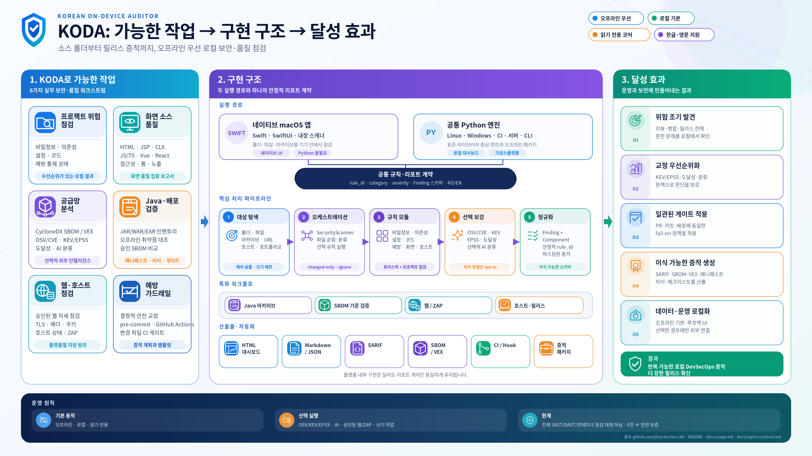

# KODA 문서

언어: [한국어](README.md) · [English](README.en.md)

KODA를 처음 쓰는 사람은 이 페이지에서 목적에 맞는 경로를 고르면 됩니다.
제품 개요와 플랫폼 선택은 [영문 루트 README](../README.md), 실제 명령 전체는
[CLI 및 로컬 사용법](usage.ko.md)에 있습니다.

## 기능과 구현 구조

위 도식은 KODA가 지원하는 점검 흐름, macOS 네이티브 앱과 공통 Python 엔진의
실행 경로, 생성되는 증적을 한눈에 정리합니다. 도식을 클릭하면 원본 크기로 볼 수
있습니다. `Python 불필요`는 macOS 네이티브 사용자가 Python을 별도로 설치할
필요가 없다는 뜻이며, 플랫폼별 내부 구성은 각 설치 문서에서 설명합니다.

## 목적별 빠른 시작

| 목적 | 얻는 결과 | 시작 문서 |
| --- | --- | --- |
| 내 프로젝트의 코드·설정·의존성을 점검 | 로컬 HTML/JSON/SARIF/SBOM 보고서와 선택형 CI 게이트 | [CLI 및 로컬 사용법](usage.ko.md) |
| macOS 앱을 설치 | 네이티브 KODA 앱 또는 Python 대시보드 도우미 | [macOS 설치](install/macos.ko.md) |
| Linux 서버에서 실행 | 사용자 경로 CLI 또는 Tracker 계정 기반 인증 포털·배포 게이트 | [Linux 설치·운영](install/linux.ko.md) |
| Linux KODA 화면과 결과 분류 확인 | 실제 결과 화면, 라이브러리·소스코드·품질 탭, 기능 흐름도 | [KODA 웹 포털 화면과 기능](koda-web-portal.ko.md) |
| KODA와 SBOM Tracker를 폐쇄망에 함께 설치 | 계정·로그아웃을 공유하고 사이트별 권한을 분리한 동일 오리진 포털 | [통합 폐쇄망 설치](../platforms/linux/suite/README.ko.md) |
| 폐쇄망 설치 오류를 진단 | 압축·주소·로그인·Dependency-Track·업로드·이미지 교체별 확인과 복구 절차 | [폐쇄망 설치 장애 대응](../platforms/linux/suite/TROUBLESHOOTING.ko.md) |
| 폐쇄망 JAR/WAR/EAR를 점검 | 오프라인 SBOM·취약점·KEV·승인 SBOM 비교 결과 | [폐쇄망 배포 개요](install/offline-delivery.md) |
| Windows 데스크톱 앱을 설치 | KODA 설치본과 별도 취약점 데이터 갱신 경로 | [Windows 설치](install/windows.ko.md) |
| 승인된 웹 서비스의 보안 상태를 점검 | 웹·ZAP 보고서. 능동 점검은 명시적 권한 필요 | [CLI 및 로컬 사용법](usage.ko.md#승인된-웹-점검) |

## 설치와 배포 (`install/`)

| 문서 | 내용 |
| --- | --- |
| [offline-delivery.md](install/offline-delivery.md) | 폐쇄망 배포 개요 — Docker 전달물 / Linux tarball / Windows 설치본+데이터 zip 비교, 점검 파이프라인, 종료 코드, 빌드 옵션 |
| [macos.ko.md](install/macos.ko.md) | macOS 설치 (App Store 앱 및 스크립트 설치) |
| [linux.ko.md](install/linux.ko.md) | Linux 설치·운영 가이드 (호스트 설치, 대시보드, Docker 전달물) |
| [koda-web-portal.ko.md](koda-web-portal.ko.md) | KODA 웹 포털 실제 예시 화면, 결과 분류 탭과 기능 흐름 |
| [통합 폐쇄망 설치](../platforms/linux/suite/README.ko.md) | KODA + KODA SBOM Tracker 단일 압축파일 설치, 공유 로그인, 사이트별 권한, 운영 명령 |
| [폐쇄망 설치 장애 대응](../platforms/linux/suite/TROUBLESHOOTING.ko.md) | 설치 중 발생한 EOF·413·흰 화면·로그인·API 키·분석 실패·안전한 재설치 대응 |
| [windows.ko.md](install/windows.ko.md) | Windows 설치본 빌드·설치 및 취약점 데이터 패키지 연결 |
| [vuln-data-refresh.md](install/vuln-data-refresh.md) | Windows 취약점 데이터(`koda-vuln-data-<date>.zip`) 현행화 절차 |
| [usage.ko.md](usage.ko.md) | 공통 Python CLI 사용법 — 설정, 보고서, CI, 자동 교정과 권한 있는 네트워크 점검 |

폐쇄망 Docker 래퍼의 운영 상세는
[platforms/linux/docker/README.md](../platforms/linux/docker/README.md),
Linux 오프라인 배포 계층 설명은
[platforms/linux/README-offline.ko.md](../platforms/linux/README-offline.ko.md)에 있습니다.
Linux 포털을 운영할 때는 8765 포트를 직접 공개하지 말고 통합 gateway의
`/koda/` 경로를 사용합니다.

## 보안 점검·연동 (`security/`)

| 문서 | 내용 |
| --- | --- |
| [java-sbom-vulnerability-scan.md](security/java-sbom-vulnerability-scan.md) | 폐쇄망 Java(JAR/WAR/EAR) SBOM·취약점 점검 런북 |
| [PRE_COMMIT.ko.md](security/PRE_COMMIT.ko.md) | KODA pre-commit 보안 게이트 |
| [GITHUB_REPOSITORY_SECURITY.ko.md](security/GITHUB_REPOSITORY_SECURITY.ko.md) | GitHub 저장소 보안 설정 체크리스트 |
| [DEPENDENCY_TRACK.ko.md](security/DEPENDENCY_TRACK.ko.md) | Dependency-Track SBOM 업로드 연동 |
| [ZAP_BASELINE.ko.md](security/ZAP_BASELINE.ko.md) | OWASP ZAP baseline DAST 실행 |
| [WEB_AUDIT.ko.md](security/WEB_AUDIT.ko.md) | 승인·프로필·oracle 기반 21개 웹취약점 자동 점검 |
| [VEX.ko.md](security/VEX.ko.md) | CycloneDX VEX 취약점 상태 추적 |
| [SLSA_SIGSTORE.ko.md](security/SLSA_SIGSTORE.ko.md) | SLSA·Sigstore 릴리스 출처 증명 |
| [NIST_SSDF_WORKFLOW.ko.md](security/NIST_SSDF_WORKFLOW.ko.md) | NIST SSDF 워크플로 증적 |
| [SECURE_BY_DESIGN.ko.md](security/SECURE_BY_DESIGN.ko.md) | CISA Secure by Design 예방 계획 |

## 기준 프로파일 (`standards/`)

| 문서 | 내용 |
| --- | --- |
| [sw-development-security-49.md](standards/sw-development-security-49.md) | 소프트웨어 개발보안 49개 항목 매핑 |
| [authoritative-mapping-audit.md](standards/authoritative-mapping-audit.md) | 행정안전부·KISA·OWASP·CWE의 현행 공식 분류와 KODA 점검 범위 검증 |

## 리포트·설계·로드맵

| 문서 | 내용 |
| --- | --- |
| [report-contract.ko.md](report-contract.ko.md) | KODA 리포트 계약 (출력 형식·필드 정의) |
| [security-dashboard-research.ko.md](security-dashboard-research.ko.md) | 대시보드 설계 근거와 구현 한계 |
| [spec-beyond-static-scanner.md](spec-beyond-static-scanner.md) | 정적 스캐너를 넘어서는 구현 명세 |
| [roadmap-ai-augmentation.md](roadmap-ai-augmentation.md) | AI 증강·자동 교정·CI/CD 로드맵 |
| [roadmap-endpoint-security.md](roadmap-endpoint-security.md) | 엔드포인트(호스트) 보안 점검 로드맵 |

`roadmap-*.md`와 `spec-beyond-static-scanner.md`는 구현 이력과 다음 확장을 위한
기획 문서입니다. 현재 지원 기능과 운영 방법의 기준으로는 사용하지 말고, 위의
설치·사용·보안 연동 문서를 사용하세요.
