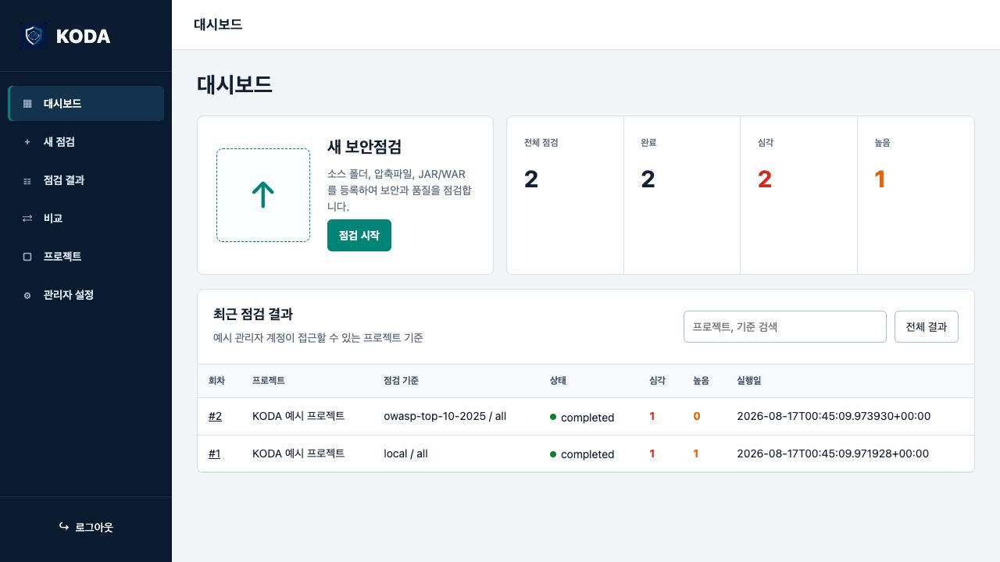
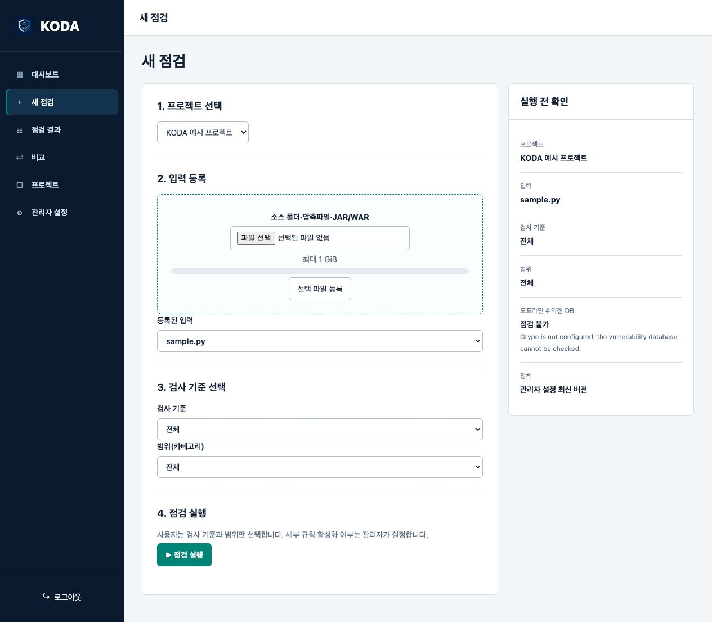
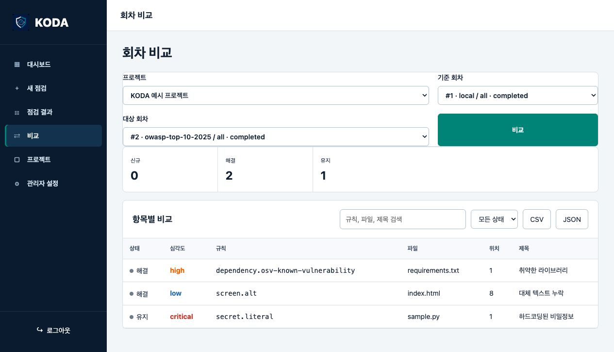
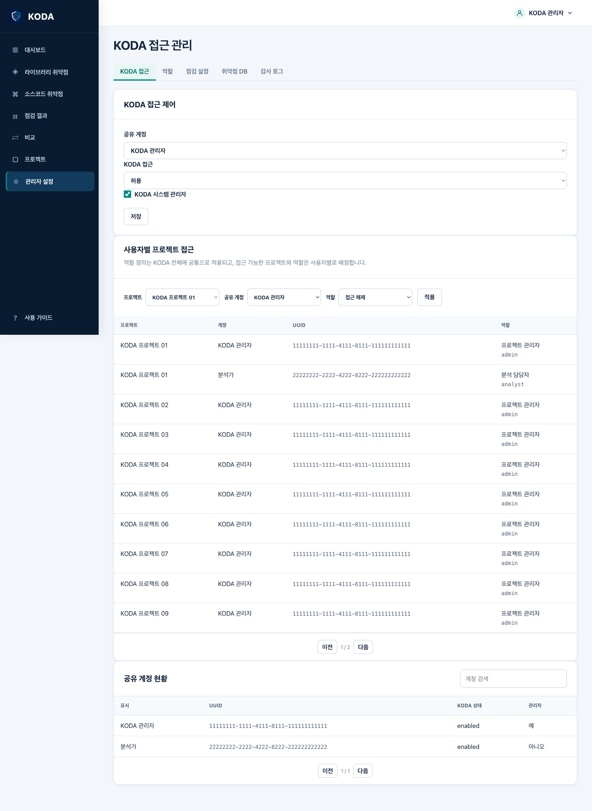
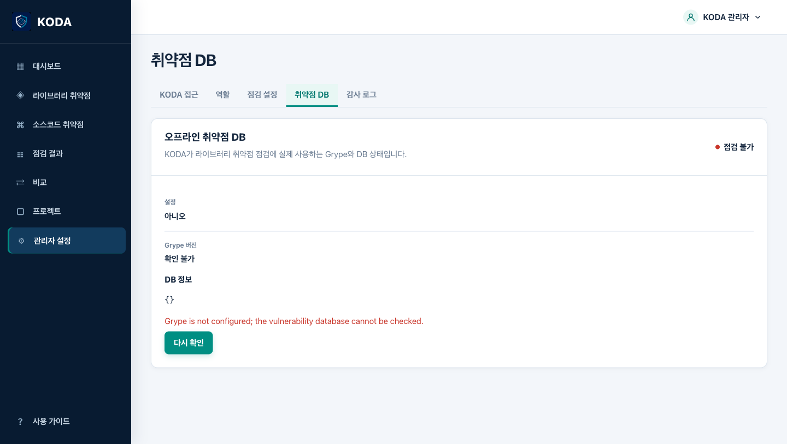

# KODA 웹 포털 화면과 기능

Linux KODA는 Tracker의 SBOM 관리 화면이 아니라 KODA 보안·품질 점검 기능을
브라우저에서 사용하는 포털입니다. 프로젝트별 입력과 분석 회차를 보관하고,
메뉴에서 라이브러리 취약점과 소스코드 취약점을 각각 실행합니다. 완료 결과 안에서는
기존 라이브러리·소스코드·품질 분류 탭도 함께 제공합니다. 사이드바 하단의
`사용 가이드`는 KODA 기능·보안 용어·지원 기준을 설명하고, 우측 상단 계정 메뉴는
현재 사용자 정보와 로그아웃을 제공합니다.

## 화면 예시

### 대시보드

### 라이브러리·소스코드 점검

사이드바에서 `라이브러리 취약점` 또는 `소스코드 취약점`을 선택합니다. 라이브러리
화면은 SBOM·manifest·lockfile·JAR/WAR와 오프라인 취약점 DB를 사용하고, 소스코드
화면은 코드·비밀정보·보안설정·예방통제 카테고리를 실행합니다. 라이브러리 점검은
검사 기준과 범위를 고르지 않고 `CVE 점검`으로 고정하며, CVE가 연결된 Grype 결과만
남깁니다. 소스코드 점검은 `전체` 또는 지원 기준·범위를 선택합니다. 입력은 최대
`1 GB` 파일을 스트리밍 등록하거나, 관리자가 연결한 GitLab 저장소의 브랜치·태그를
선택할 수 있습니다. GitLab 입력은 실행 전에 commit SHA로 고정됩니다. 오프라인 취약점 DB를 사용할 수 없으면
라이브러리 화면에서 실행 전에 `점검 불가`와 원인을 표시합니다.

### 결과 탭

위 이미지는 실제 KODA 결과 화면을 대표 점검 데이터로 렌더링한 예시입니다.
점검 결과는 같은 회차 안에서 다음 탭으로 분류됩니다.

- `라이브러리 취약점`: manifest·lockfile 등에서 식별한 구성요소와 PURL을 번들된
  오프라인 Grype DB로 대조한 결과입니다.
- `소스코드 취약점`: 코드, 비밀정보, 보안설정, 예방통제 규칙의 결과입니다.
- `품질 점검`: 화면 품질과 접근성 규칙의 결과입니다.
- `전체`: 위 결과를 한 번에 조회합니다.

탭을 바꿔도 제목·규칙 ID·파일 검색과 심각도 필터, 상세 증거·조치 방법은 그대로
사용합니다. 라이브러리 회차의 `라이브러리 취약점 보고서`는 구성요소·버전·취약점
식별자 중심의 메인·상세 HTML을 표시합니다. 완료 회차에서는 HTML ZIP·PDF·Excel·
JSON·Markdown과 CycloneDX 1.6·국정원 NIS-SBOM 1.0을 내려받을 수 있습니다.

### 회차 비교와 접근 관리

비교 결과는 항목별 검색·상태 필터와 CSV·JSON 내보내기를 제공합니다. KODA 관리자는
공유 계정의 KODA 접근·시스템 관리자 여부와 사용자별 프로젝트 역할을 설정합니다.
`설정 > 연동 설정`에서는 시스템 관리자만 서비스 계정이 접근 가능한 저장소를 KODA 프로젝트에 연결합니다.
Tracker 서비스·환경·전송 토큰은 연결 시 자동 생성 또는 재사용됩니다. 시스템 관리자는
GitLab HTTPS URL, 조회용 `read_api` PAT와 결과 저장용 `api` PAT를 분리해 저장·교체할
수 있으며 PAT와 사설 CA는 다시 표시되지 않는 write-only 값입니다. GitLab API 호출은
KODA만 수행하고 Tracker에는 GitLab 자격증명을 저장하지 않습니다.

### 오프라인 취약점 DB 상태

개발 환경처럼 Grype 실행 파일이나 DB가 없으면 `점검 불가`로 실패 폐쇄합니다.
폐쇄망 배포 이미지에서는 번들된 Grype 버전과 DB 메타데이터가 이 화면에 표시되어야
하며, 이 정보가 확인되지 않으면 라이브러리 취약점 점검을 시작하지 않습니다.

## 기능 흐름

라이브러리 점검은 CVE 기준으로 고정되고, 소스코드 점검 사용자는 검사 기준과 범위를
선택합니다. 관리자는 활성 규칙 정책을 관리합니다.
실행 시점의 입력 해시·정책 버전·요청 계정·스캐너 정보는 회차 스냅샷에 함께
저장되므로 결과를 다시 열거나 이전 회차와 비교할 수 있습니다.

점검 중에는 준비·스캔·마무리 단계와 진행률을 표시하며 취소할 수 있습니다. 점검이
완료·실패·취소되면 회차 스냅샷과 결과만 보관하고 원본 입력 파일은 삭제합니다. 원본이
필요한 새 점검은 파일을 다시 등록해야 하며 결과 화면에는 다시 실행 버튼이 없습니다.
라이브러리 단계에는 실제 사용한 Grype 버전, 오프라인 DB 메타데이터, 조회 구성요소 수와 경고를
표시하므로 `취약점 0건`과 `DB 점검 실패`를 구분할 수 있습니다. KODA 입력 파일은
브라우저 메모리에 Base64로 올리지 않고 화면 안내 기준 최대 1 GB까지 스트리밍 업로드합니다.
GitLab 회차에는 저장소·ref·commit SHA·아카이브 해시를 기록합니다. 완료 CycloneDX를
Tracker로 전송해 분석 결과를 받은 뒤 GitLab 결과 브랜치·Merge Request와 commit당
하나의 비공개 CVE 요약 Issue를 생성하며, 결과 화면에는 `Tracker 전송`과 `GitLab 결과
등록`을 분리한 상태·링크·재시도 기능을 함께 표시합니다. 이 흐름과 별도로 KODA가 확정한 코드·비밀정보·보안설정·예방통제
취약점은 항목별 비공개 Issue로 관리합니다. 열린 동일 Issue에는 새 회차 댓글을
추가하고 닫힌 Issue는 새로 생성하며, 품질·검토 필요·미검증 결과는 제외합니다. GitLab
쓰기 실패는 점검이나 Tracker 전송 상태를 변경하지 않습니다. 라이브러리 CVE는 Tracker
요약 Issue에만 포함합니다.

계정 가입과 승인은 KODA-SBOM-Tracker가 단일 원본으로 관리합니다. KODA 관리자 화면은
공유 계정의 KODA 접근 차단·허용, 시스템 관리자 여부, 사용자별 프로젝트 역할을
관리합니다. 전역 역할 정책은 화면 접근 권한과 기능 실행 권한으로 나누고, 점검 규칙은
기준별 카드에서 규칙별 활성 체크박스로 설정합니다.

기능도는 [diagram-design](https://github.com/cathrynlavery/diagram-design)의
정보 밀도, 제한된 강조색, 정적 SVG 접근성 원칙을 참고해 KODA 문서용으로 새로
작성했습니다. 외부 스크립트나 이미지 의존성은 없습니다.

## 관련 문서

- [Linux 설치·운영](install/linux.ko.md)
- [통합 폐쇄망 설치](../platforms/linux/suite/README.ko.md)
- [GitLab 저장소 연동](gitlab-integration-ko.md)
- [KODA 리포트 계약](report-contract.ko.md)
