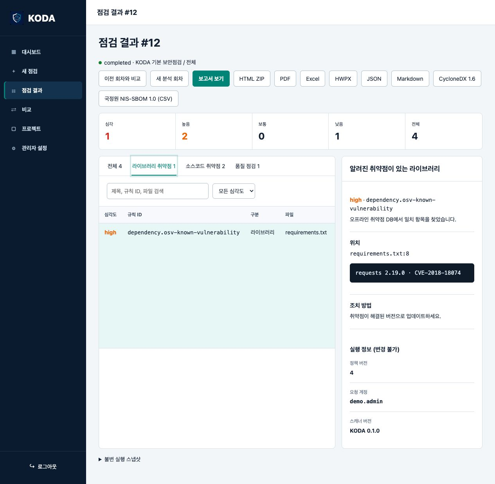
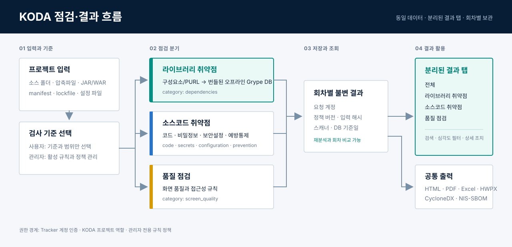

# KODA 웹 포털 화면과 기능

Linux KODA는 Tracker의 SBOM 관리 화면이 아니라 KODA 보안·품질 점검 기능을
브라우저에서 사용하는 포털입니다. 프로젝트별 입력과 분석 회차를 보관하고,
완료 결과를 라이브러리 취약점·소스코드 취약점·품질 점검 탭으로 나눠 조회합니다.

## 결과 화면 예시

위 이미지는 실제 KODA 결과 화면을 대표 점검 데이터로 렌더링한 예시입니다.
점검 결과는 같은 회차 안에서 다음 탭으로 분류됩니다.

- `라이브러리 취약점`: manifest·lockfile 등에서 식별한 구성요소와 PURL을 번들된
  오프라인 Grype DB로 대조한 결과입니다.
- `소스코드 취약점`: 코드, 비밀정보, 보안설정, 예방통제 규칙의 결과입니다.
- `품질 점검`: 화면 품질과 접근성 규칙의 결과입니다.
- `전체`: 위 결과를 한 번에 조회합니다.

탭을 바꿔도 제목·규칙 ID·파일 검색과 심각도 필터, 상세 증거·조치 방법은 그대로
사용합니다. 완료 회차의 HTML·PDF·Excel·HWPX·JSON·Markdown 보고서와 CycloneDX
1.6·국정원 NIS-SBOM 1.0 출력 계약도 바뀌지 않습니다.

## 기능 흐름

사용자는 검사 기준과 범위만 선택하고, 관리자는 활성 규칙 정책을 관리합니다.
실행 시점의 입력 해시·정책 버전·요청 계정·스캐너 정보는 회차 스냅샷에 함께
저장되므로 결과를 다시 열거나 이전 회차와 비교할 수 있습니다.

기능도는 [diagram-design](https://github.com/cathrynlavery/diagram-design)의
정보 밀도, 제한된 강조색, 정적 SVG 접근성 원칙을 참고해 KODA 문서용으로 새로
작성했습니다. 외부 스크립트나 이미지 의존성은 없습니다.

## 관련 문서

- [Linux 설치·운영](install/linux.ko.md)
- [통합 폐쇄망 설치](../platforms/linux/suite/README.ko.md)
- [KODA 리포트 계약](report-contract.ko.md)
